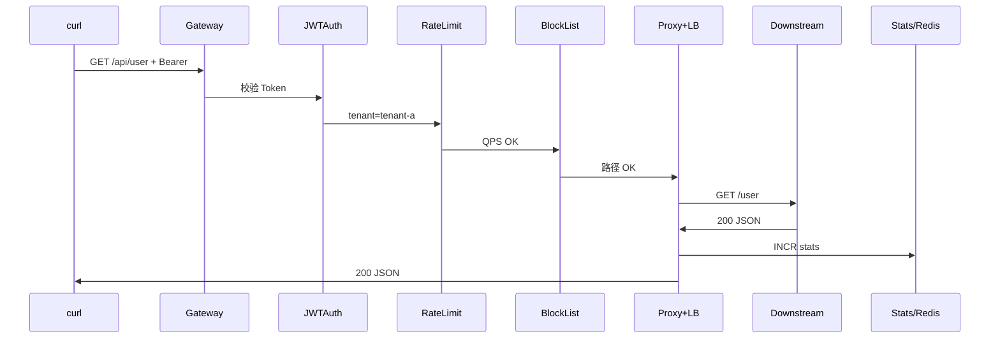

# ⑥ 中间件链（1 周）

> 所属：[阶段 3 目录](./README.md) · 前置：①~⑤ 各模块单独跑通  
> 本模块产出：完整 `cmd/gateway/main.go` 组装 + 黑白名单 + 简单熔断 + **阶段 3 毕业自测**

---

## 模块目标

把 ①~⑤ 拼成 README 描述的请求链，并补充访问控制与熔断：

```
Recovery → Logger → JWT → RateLimit → BlockList → Proxy(LB) → Stats → 响应
```

**结束时应达到**：一个能跑的单体网关雏形，通过 [毕业自测](#第-6-7-天毕业自测)。

---

## 进度对照

| 天 | 任务 | 状态 |
|----|------|------|
| 第 1 天 | 确定顺序，重写 main.go 组装 | ⬜ |
| 第 2 天 | 黑白名单中间件 | ⬜ |
| 第 3 天 | 简单熔断器 | ⬜ |
| 第 4 天 | 各中间件独立可测 + 错误场景 | ⬜ |
| 第 5 天 | 整理目录 + 配置常量 | ⬜ |
| 第 6~7 天 | 毕业自测 + 能讲完整链路 | ⬜ |

---

## 第 1 天：组装 main.go

### 任务

1. 梳理所有依赖：Registry、Balancer、Redis、Secret
2. 路由分两组：`/gateway/*` 管理 vs `/api/*` 业务
3. 确认中间件顺序

### 完整顺序

| 顺序 | 中间件 | 失败码 | Abort |
|------|--------|--------|-------|
| 1 | Recovery | 500 | - |
| 2 | RequestLogger | - | - |
| 3 | JWTAuth | 401 | ✓ |
| 4 | RateLimit | 429 | ✓ |
| 5 | BlockList | 403 | ✓ |
| 6 | TrafficStats | - | - |
| 7 | proxy.Handler | 502/503 | - |

### 参考代码 — `cmd/gateway/main.go` 骨架

```go
package main

import (
    "log"
    "time"

    "go-proxy-demo/gateway/auth"
    "go-proxy-demo/gateway/handler"
    "go-proxy-demo/gateway/lb"
    "go-proxy-demo/gateway/middleware"
    "go-proxy-demo/gateway/proxy"
    redisx "go-proxy-demo/gateway/redis"
    "go-proxy-demo/gateway/registry"

    "github.com/gin-gonic/gin"
)

func main() {
    rdb := redisx.New("localhost:6379")

    reg := registry.NewMemory([]string{
        "http://localhost:9001",
        "http://localhost:9002",
        "http://localhost:9003",
    })
    balancer := lb.NewRoundRobin()
    registry.RefreshBalancer(reg, balancer)
    registry.StartHealthCheck(reg, balancer, 10*time.Second)

    admin := &handler.Admin{Reg: reg, LB: balancer, RDB: rdb}

    r := gin.New()
    r.Use(gin.Recovery())
    r.Use(middleware.RequestLogger())

    // --- 管理面（无 JWT）---
    r.GET("/gateway/health", admin.Health)
    r.POST("/gateway/login", admin.Login)
    r.GET("/gateway/services", admin.ListServices)
    r.POST("/gateway/services", admin.RegisterService)
    r.DELETE("/gateway/services", admin.DeregisterService)
    r.GET("/gateway/stats", admin.GetStats)

    // --- 数据面（完整中间件链）---
    api := r.Group("/api")
    api.Use(middleware.JWTAuth(auth.DefaultSecret))
    api.Use(middleware.RateLimit(rdb, 10))
    api.Use(middleware.BlockList([]string{"/api/internal"}))
    api.Use(middleware.TrafficStats(rdb))
    api.Any("/*path", proxy.Handler(balancer))

    log.Println("gateway listening on :8080")
    r.Run(":8080")
}
```

### 检验标准

- [ ] `/gateway/*` 不经过 JWT / RateLimit
- [ ] `/api/*` 经过完整链
- [ ] main 只做 wiring，逻辑在 package 里

---

## 第 2 天：黑白名单

### 任务

1. 演进阶段 2 的 `BlockInternal` 为通用 `BlockList`
2. 支持前缀匹配：`/api/internal` 拦截所有子路径
3. （可选）`AllowList`：只允许 listed 路径

### 参考代码 — `gateway/middleware/blocklist.go`

```go
package middleware

import (
    "strings"

    "github.com/gin-gonic/gin"
)

func BlockList(prefixes []string) gin.HandlerFunc {
    return func(c *gin.Context) {
        path := c.Request.URL.Path
        for _, p := range prefixes {
            if strings.HasPrefix(path, p) {
                c.JSON(403, gin.H{"code": 403, "msg": "forbidden"})
                c.Abort()
                return
            }
        }
        c.Next()
    }
}
```

### 验证

```powershell
curl.exe -H "Authorization: Bearer $token" http://localhost:8080/api/internal/secret
# 403，且不转发到下游

curl.exe -H "Authorization: Bearer $token" http://localhost:8080/api/user
# 200
```

### 与 README 对照

README 中间件链含「黑白名单」——本实现为**路径黑名单**；IP 黑名单可同样用 middleware + map 扩展。

### 检验标准

- [ ] 黑名单路径 403，不消耗下游资源
- [ ] 403 在 proxy 之前，下游看不到请求
- [ ] 配置可从 main 传入 slice，便于阶段 4 改配置文件

---

## 第 3 天：简单熔断

### 任务

1. 统计连续下游失败次数（502/504）
2. 超过阈值 `N` 进入「开路」状态 `T` 秒，直接 503
3. 半开：试探一次成功则关闭

### 概念

| 状态 | 行为 |
|------|------|
| **Closed** | 正常转发 |
| **Open** | 直接 503，不调用下游 |
| **Half-Open** | 允许少量试探请求 |

### 参考代码 — `gateway/middleware/circuitbreaker.go`

```go
package middleware

import (
    "sync"
    "time"

    "github.com/gin-gonic/gin"
)

type breaker struct {
    mu           sync.Mutex
    failures     int
    threshold    int
    openUntil    time.Time
    cooldown     time.Duration
}

func CircuitBreaker(threshold int, cooldown time.Duration) gin.HandlerFunc {
    b := &breaker{threshold: threshold, cooldown: cooldown}
    return func(c *gin.Context) {
        b.mu.Lock()
        if time.Now().Before(b.openUntil) {
            b.mu.Unlock()
            c.JSON(503, gin.H{"code": 503, "msg": "circuit open"})
            c.Abort()
            return
        }
        b.mu.Unlock()

        c.Next()

        b.mu.Lock()
        defer b.mu.Unlock()
        if c.Writer.Status() >= 500 {
            b.failures++
            if b.failures >= b.threshold {
                b.openUntil = time.Now().Add(b.cooldown)
                b.failures = 0
            }
        } else if c.Writer.Status() < 500 {
            b.failures = 0
        }
    }
}
```

### 验证

```powershell
# 停掉全部下游，连续请求触发熔断
1..5 | ForEach-Object {
    curl.exe -s -o NUL -w "%{http_code}\n" -H "Authorization: Bearer $token" http://localhost:8080/api/user
}
# 前几次 502/503，之后 circuit open 503
```

### 检验标准

- [ ] 下游全挂时不会无限阻塞
- [ ] cooldown 后恢复试探
- [ ] 能解释熔断与限流的区别（保护下游 vs 保护网关资源）

---

## 第 4 天：错误场景矩阵

### 任务

逐条验证下表，确保状态码与中间件行为符合预期。

| 场景 | 期望 | 计限流 | 计统计 |
|------|------|--------|--------|
| 无 Token | 401 | 否 | 否 |
| 错误 Token | 401 | 否 | 否 |
| 超限 | 429 | - | 否 |
| 黑名单路径 | 403 | 否* | 否 |
| 无健康节点 | 503 | 是** | 否 |
| 下游 404 | 404 | 是 | 否*** |
| 正常 200 | 200 | 是 | 是 |

\* 若 RateLimit 在 BlockList 前，仍会占配额——可按需求调整顺序。  
\*\* 已通过 JWT 的请求。  
\*\*\* 404 通常不算「成功转发」，Stats 只计 2xx。

### 推荐顺序讨论

若希望「黑名单不消耗限流配额」，顺序应为：

```
JWT → BlockList → RateLimit → Stats → Proxy
```

README 常见顺序是鉴权 → 限流 → 访问控制，两种皆可，**文档里写清楚你的选择**。

### 检验标准

- [ ] 完成上表至少 6 种场景 curl 验证
- [ ] 能解释 401 为何不计入 stats

---

## 第 5 天：整理与配置

### 任务

1. 新建 `gateway/config/config.go` 集中常量
2. 删除调试代码、临时路由
3. 确认最终目录与 [phase3 README](../phase3-readme-features.md#推荐最终目录) 一致

### 参考 config

```go
package config

const (
    GatewayAddr   = ":8080"
    RedisAddr     = "localhost:6379"
    JWTSecret     = "phase3-dev-secret-change-me"
    RateLimitQPS  = 10
    HealthInterval = 10 // seconds
    CBThreshold   = 5
    CBCooldownSec = 30
)
```

### 最终目录检查清单

```
gateway/
├── auth/
├── config/
├── handler/
├── lb/
├── middleware/
├── proxy/
├── ratelimit/
├── redis/
├── registry/
├── stats/
└── tenant/
```

### 检验标准

- [ ] 无硬编码散落各处
- [ ] `go build ./...` 通过
- [ ] 每个 package 有单一职责

---

## 第 6~7 天：毕业自测

### 启动清单

```powershell
cd d:\A_Software\Java\SAVE\Gateway\go-proxy-demo
docker start redis

# 终端 1~3
go run ./cmd/downstream --port 9001
go run ./cmd/downstream --port 9002
go run ./cmd/downstream --port 9003

# 终端 4
go run ./cmd/gateway
```

### 自测命令

```powershell
# 0. 拿 Token
$resp = curl.exe -s -X POST http://localhost:8080/gateway/login `
  -H "Content-Type: application/json" -d '{"tenant":"tenant-a"}'
$token = ($resp | ConvertFrom-Json).data.token

# 1. 鉴权
curl.exe -w "\nHTTP %{http_code}\n" http://localhost:8080/api/user
curl.exe -H "Authorization: Bearer $token" http://localhost:8080/api/user

# 2. 负载均衡
1..6 | ForEach-Object { curl.exe -s -H "Authorization: Bearer $token" http://localhost:8080/api/user }

# 3. 限流
1..15 | ForEach-Object { curl.exe -s -o NUL -w "%{http_code}\n" -H "Authorization: Bearer $token" http://localhost:8080/api/user }

# 4. 服务注册
curl.exe -X POST http://localhost:8080/gateway/services -H "Content-Type: application/json" -d '{"url":"http://localhost:9004"}'

# 5. 流量统计
curl.exe "http://localhost:8080/gateway/stats?tenant=tenant-a"

# 6. 黑白名单
curl.exe -H "Authorization: Bearer $token" http://localhost:8080/api/internal/secret

# 7. 网关健康
curl.exe http://localhost:8080/gateway/health
```

### 必须讲出的 8 步链路

1. curl 带 Bearer 访问 `/api/user`
2. JWTAuth 校验 iss ∈ 租户列表
3. RateLimit 检查 Redis QPS
4. BlockList 检查路径
5. Balancer 选出下游 URL
6. ReverseProxy 去 `/api` 前缀并转发
7. TrafficStats 对 2xx INCR
8. RequestLogger 打印耗时

### 模块 / 阶段结束标准

- [ ] 毕业自测全部通过
- [ ] 能不看文档讲 8 步
- [ ] 能画完整 mermaid 时序图
- [ ] 代码结构清晰，非 example 拼凑

**全部打勾 → [阶段 4](../learning-roadmap.md#阶段-4工程化可选项目收尾) 或可选 [⑦ TCP/gRPC](./07-tcp-grpc.md)**

---

## 完整时序图



---

## 常见问题

### Q：中间件顺序搞错了怎么办？

画洋葱图，从外到内写 `Use` 顺序；用 curl 逐个禁用中间件定位。

### Q：熔断和 registry 健康检查重复吗？

健康检查**预防**打到坏节点；熔断**快速失败**保护网关（如下游超时雪崩）。

### Q：这就是 README 完整版吗？

≈ HTTP 核心。还缺 Vue Admin、MySQL、TCP/gRPC、Docker、压测——见阶段 4。
