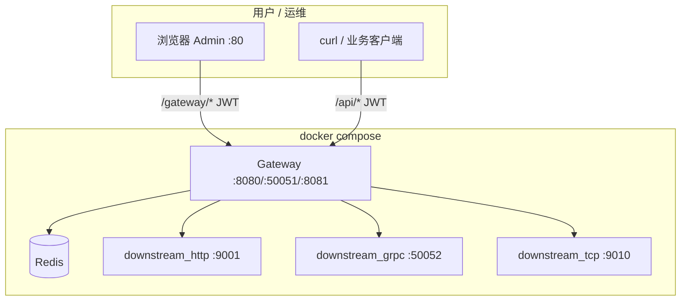

# 网关项目学习路线（4 个阶段）

> 从零基础到能看懂并实现 `ReadME.md` 中的网关系统。  
> 原则：**不要跳级**，每阶段有明确的「结束标准」。

---

## 先建立一张地图

README 里的术语，先用「人话」理解：

| 词 | 含义 |
|----|------|
| **网关** | 大楼前台：所有人先到这里，再被带到不同房间 |
| **反向代理** | 前台替你去叫后面的服务员，你不需要知道服务员坐在哪 |
| **负载均衡** | 有 3 个服务员，前台决定这次叫哪一个 |
| **JWT 鉴权** | 进门刷卡，没卡不让进 |
| **限流** | 每分钟最多进 100 人，多了排队或拒绝 |
| **中间件** | 进门前依次经过：安检 → 验票 → 计数 |
| **微服务** | 一个系统拆成很多小服务，各自独立跑 |
| **Redis** | 很快的共享记事本，多台机器都能读写 |
| **Gin** | Go 里写 Web 服务的框架（类似 Spring Boot 之于 Java） |

**现阶段不需要会写这些，只需要知道它们各自干什么。**

---

## 阶段 0：计算机基础（1~2 周）

**目标**：能听懂后面所有内容在说什么。

### 必学 4 件事

#### 1. HTTP 是什么

- 浏览器访问网址时发生了什么
- GET / POST 的区别
- 常见状态码：200 成功、404 找不到、401 没权限、429 被限流

**动手验证**（基于 `go-minimal-demo`）：

```powershell
# 成功
curl http://localhost:8080/hello

# 404
curl http://localhost:8080/xxx
```

#### 2. 客户端 / 服务端

- 你的程序 = **服务端**，启动后一直等着
- 浏览器 / curl = **客户端**，发请求过来

#### 3. 端口

- `8080` 就像「房间号」
- 同一台电脑上，不同程序用不同端口，否则会冲突

#### 4. JSON

- 前后端传数据最常用的格式
- 示例：`{"name": "张三", "age": 18}`

### 推荐资源

- [MDN HTTP 入门（中文）](https://developer.mozilla.org/zh-CN/docs/Web/HTTP/Overview)

### 阶段 0 结束标准

- [ ] 能说出 GET 和 POST 的区别
- [ ] 能解释 200 / 404 / 401 / 429 各代表什么
- [ ] 知道「客户端发请求 → 服务端响应」的基本流程
- [ ] 能读懂简单 JSON

---

## 阶段 1：会写最简单的 Web 服务（2~3 周）

**目标**：理解「一个请求怎么到一个函数」。

> 详细每日计划、参考代码、验证命令见 → **[阶段 1 详细教程](./phase1-web-service.md)**

**建议选 Go**，起点：[`go-minimal-demo/`](../go-minimal-demo/)

| 天数 | 任务 |
|------|------|
| 第 1 天 | 跑通 demo，改返回文字 |
| 第 2 天 | 加 `/time`、`/greet?name=张三` 接口 |
| 第 3 天 | 返回 JSON 而不是纯文字 |
| 第 4 天 | 加 POST 接口，接收 JSON |
| 第 5~7 天 | 学 Gin 框架，把 demo 用 Gin 重写 |

### 阶段 1 结束标准

- [ ] 能独立写一个带 3~5 个接口的小 API
- [ ] 能返回 JSON 格式的响应
- [ ] 能接收 query 参数和 POST JSON body
- [ ] 用 Gin 重写 demo 并能跑通

---

## 阶段 2：理解「代理」和「中间件」（2~3 周）

**目标**：搞懂 README 的核心——网关到底在干什么。

> 详细每日计划、参考代码、验证命令见 → **[阶段 2 详细教程](./phase2-proxy-middleware.md)**

> 原则：**全程 Gin**，与 README 网关项目一致

**起点**：阶段 1 的 Gin API 能力；本阶段新建 [`go-proxy-demo/`](../go-proxy-demo/)

| 天数 | 任务 |
|------|------|
| 第 1 天 | 理解反向代理，同时跑两个 Gin 程序 |
| 第 2 天 | 完善下游服务（9001） |
| 第 3 天 | Gin 网关 + `ReverseProxy` 透明转发 |
| 第 4 天 | 路径前缀改写（`/api/*` → 下游） |
| 第 5~6 天 | 抽取 proxy 包 + Gin 中间件 |
| 第 7 天 | 整理结构 + 毕业自测 |

用户访问 `http://localhost:8080/api/user`，网关转发到 `http://localhost:9001/user`。  
用户只认识 8080，不知道 9001 的存在——**搞懂这一步，README 就懂了一半**。

### 阶段 2 结束标准

- [ ] 能同时启动两个 Gin 程序（8080 网关 + 9001 下游）
- [ ] 8080 能把 `/api/*` 转发到 9001
- [ ] 能在转发前加 Gin 日志中间件
- [ ] 能画出一幅「请求经过网关到下游」的流程图

---

## 阶段 3：逐个攻克 README 功能（1~2 个月）

**目标**：实现 README 描述的核心功能。  
**原则**：一次只学一个，单独跑通、单独测试，再拼到一起，最终直接完成项目雏形，而不是 example。

> 详细模块计划、参考代码、验证命令见 → **[阶段 3 详细教程目录](./phase3/README.md)**

### 功能清单（按顺序）

| 顺序 | 功能 | 学什么 | 预计时间 |
|------|------|--------|----------|
| ① | 负载均衡 | 随机 / 轮询算法，维护节点列表 | 3~5 天 |
| ② | JWT 鉴权 | Token 结构、Bearer Header | 3~5 天 |
| ③ | Redis 限流 | Redis 基础 + 令牌桶算法 | 1 周 |
| ④ | 服务注册 | 内存里动态增删节点 | 3~5 天 |
| ⑤ | 流量统计 | Redis 计数器 | 3~5 天 |
| ⑥ | 中间件链 | 鉴权 → 限流 → 转发 → 审计 | 1 周 |
| ⑦ | TCP / gRPC | 标准库 net + grpc-proxy | 各 1~2 周（可后做） |

### 各功能难度参考

| 策略 / 功能 | 难度 |
|-------------|------|
| 随机负载均衡 | ⭐ 简单 |
| 轮询负载均衡 | ⭐ 简单 |
| 加权轮询 | ⭐⭐ 中等 |
| 一致性 Hash | ⭐⭐⭐ 较难 |
| JWT 解析 | ⭐⭐ 中等 |
| Redis 单机限流 | ⭐⭐ 中等 |
| Redis 分布式限流 | ⭐⭐⭐ 较难 |
| TCP 透明代理 | ⭐⭐⭐ 较难 |
| gRPC 代理 | ⭐⭐⭐⭐ 难 |

### 阶段 3 结束标准

- [ ] 有能跑的单体网关：鉴权 + 限流 + 转发 + 轮询 LB
- [ ] 动态服务注册 / 下线可用
- [ ] Redis 流量统计可用
- [ ] 中间件链：鉴权 → 限流 → 熔断 / 黑白名单

---

## 阶段 4：工程化（可选，项目收尾）

**目标**：把阶段 3 的「能跑的网关」变成 README 描述的**完整项目**——可部署、可管理、可压测、可答辩。

> 详细每日计划、Docker / wrk / Vue 任务分解见 → **[阶段 4 详细教程](./phase4-engineering.md)**

### 前置条件

完成阶段 3 毕业自测（或本仓库 `Gateway/` 已具备）：

- [ ] HTTP 网关：JWT → 限流 → LB → ReverseProxy
- [ ] 管理 API：`/gateway/login`、`/gateway/services`、统计接口
- [ ] `gateway.yaml` 配置可启动
- [ ] （加分）gRPC / TCP 透明代理已接入

### 阶段 4 要补什么？

阶段 3 解决「功能有没有」；阶段 4 解决「能不能交付」：

```
阶段 3 成果                         阶段 4 补齐
─────────────────────────────────────────────────────
curl 调管理 API          →    Vue Admin 可视化
go run 本地启动          →    Docker Compose 一键部署
Redis 里有计数           →    大盘图表展示
感觉「应该挺快」         →    wrk 压测报告（QPS / P99）
租户写死在 yaml          →    MySQL 持久化（可选）
/gateway/* 无鉴权        →    Admin Token 保护
```

### 功能清单（按推荐顺序）

| 顺序 | 模块 | 学什么 | 预计时间 | 详细教程 |
|------|------|--------|----------|----------|
| ① | Vue Admin | 对接 `/gateway/*`，服务/租户管理 | 1~2 周 | [phase4 §①](./phase4-engineering.md#模块-①vue-admin-管理界面) |
| ② | 统计大盘 | 7 日请求量折线图、租户卡片 | 3~5 天 | [phase4 §②](./phase4-engineering.md#模块-②统计大盘) |
| ③ | Docker 部署 | Dockerfile + compose（网关+Redis+下游） | 1~2 天 | [phase4 §③](./phase4-engineering.md#模块-③docker-部署) |
| ④ | wrk 压测 | 直连 vs 经网关 QPS、延迟对比 | 3~5 天 | [phase4 §④](./phase4-engineering.md#模块-④wrk-压测与性能调优) |
| ⑤ | MySQL 持久化 | 租户、服务注册落库 | 1 周（可选） | [phase4 §⑤](./phase4-engineering.md#模块-⑤mysql-持久化可选) |
| ⑥ | 配置与运维 | 环境变量、管理 API 鉴权、优雅退出 | 2~3 天 | [phase4 §⑥](./phase4-engineering.md#模块-⑥配置与运维) |
| ⑦ | TLS | HTTPS / gRPC 证书（可选） | 1 周 | [phase4 §⑦](./phase4-engineering.md#模块-⑦tls可选) |

### 各模块难度参考

| 任务 | 难度 |
|------|------|
| Docker Compose 跑通网关 + Redis | ⭐⭐ |
| Vue Admin 4 页面对接现有 API | ⭐⭐⭐ |
| ECharts 统计大盘 | ⭐⭐ |
| wrk 压测 + 写报告 | ⭐⭐ |
| MySQL 替换内存 Registry | ⭐⭐⭐ |
| TLS 终止 / ALPN 单端口 | ⭐⭐⭐⭐ |

### 架构目标（阶段 4 完成后）



### 与 README 终点的对齐

| README 描述 | 阶段 4 交付物 |
|-------------|---------------|
| Vue 管理界面 | `admin/` 前端工程 |
| 大盘统计 | Dashboard 页 + `/gateway/statistics/*` |
| iPanel / Docker 部署 | `Dockerfile` + `docker-compose.yml` |
| wrk 压测 9k → 6.5k QPS | 见仓库根目录 [`bench/`](../../../bench/README.md) |
| MySQL 租户管理 | `registry` MySQL 实现（可选） |
| 三协议网关 | 阶段 3/⑦ 已有，阶段 4 文档与 Admin 展示 |

### 阶段 4 结束标准

**答辩最低线（必做）：**

- [ ] `docker compose up` 后网关、Redis、至少 1 个下游可用
- [ ] Admin 能登录、注册/下线服务、查看统计图表
- [ ] wrk 压测：有「直连下游 vs 经网关」对比表（QPS + 延迟）
- [ ] README 更新启动方式与界面截图

**加分项：**

- [ ] MySQL 持久化，重启后服务列表不丢
- [ ] 管理 API（`/gateway/services` 等）需 Admin 鉴权
- [ ] gRPC / TCP 演示脚本或 Admin 入口
- [ ] CI 自动 `go test` / `go build`

### 建议时间线（4 周示例）

| 周 | 重点 |
|----|------|
| 第 1 周 | Vue 项目初始化 + 登录 + 服务管理页 |
| 第 2 周 | 统计大盘 + Docker 化 + compose 联调 |
| 第 3 周 | wrk 压测、调优、写报告 |
| 第 4 周 | MySQL（可选）、文档、答辩材料 |

---

## 和 README 项目的关系

```
你现在在这里 ↓

[Go demo 能跑] → [Gin API] → [反向代理] → [中间件] → [LB/JWT/Redis] → [完整网关] → [Vue/Docker/压测]
      ✅            阶段 1        阶段 2         阶段 3 ①~⑥        阶段 3 ⑦        阶段 4
```

README 描述的是**终点**，不是**起点**。

---

## 学习方法

### 1. 不要只看，要动手改

```
❌ 看 2 小时视频，一行代码没写
✅ 看 20 分钟，写 40 分钟，改到能跑
```

### 2. 一次只解决一个问题

```
今天：Go demo 返回 JSON
明天：加 query 参数
后天：用 Gin 重写
```

### 3. 遇到不懂的词，查一个记一个

建议维护一份自己的术语笔记：

```
JWT          = 一种登录凭证，放在 Header 里
ReverseProxy = Go 标准库，把请求转到别的服务器
Gin          = Go 的 Web 框架
```

### 4. 画流程图（纸笔即可）

每个功能画清楚：

```
浏览器 --GET /hello--> Go 程序 --?--> 返回文字
```

搞不清就画，画清楚就懂了一半。

---

## 推荐学习资源

| 优先级 | 资源 | 用途 |
|--------|------|------|
| ★★★ | [Go 官方 Tour](https://go.dev/tour/zh/welcome/1) | Go 语言基础 |
| ★★★ | 本地 `go-minimal-demo/` | 每天改一改 |
| ★★★ | [Gin 文档 Quickstart](https://gin-gonic.com/docs/quickstart/) | Web 框架 |
| ★★☆ | [MDN HTTP](https://developer.mozilla.org/zh-CN/docs/Web/HTTP) | 理解协议 |
| ★★☆ | [JWT 介绍（jwt.io）](https://jwt.io/introduction) | 理解鉴权 |
| ★☆☆ | Redis 官方 Quick Start | 用到限流时再学 |

**不建议现在看**：Kubernetes、微服务架构大部头、云原生全套——容易越看越懵。

---

## 7 天入门计划（阶段 0 → 阶段 2 过渡）

| 天 | 任务 | 检验标准 |
|----|------|----------|
| Day 1 | 跑通 Go demo，用 curl 访问 `/hello` | 能解释每行代码 |
| Day 2 | 加 2 个新接口，返回 JSON | 浏览器能看到 JSON |
| Day 3 | 学 Go 基础：变量、函数、结构体 | 完成 Tour 前 5 节 |
| Day 4 | 安装 Gin，用 Gin 重写 demo | `go run` 能跑 |
| Day 5 | 学 HTTP 概念：Header、Status Code | 能说出 200/404/401 含义 |
| Day 6 | 启动两个 Go 程序（8080 和 9001） | 两个都能访问 |
| Day 7 | 8080 把请求转发到 9001 | **第一个「迷你网关」跑通** |

Day 7 完成时，即已**入门网关**。

---

## 常见问题

### Q：Spring Boot demo 还要学吗？

Go 是本项目主线，Spring Boot demo 帮助理解「Web 服务是什么」。时间紧可以只做 Go。

### Q：TCP / gRPC 必须做吗？

不必须。先把 HTTP 网关做稳，TCP/gRPC 是加分项。

### Q：多久能做完整个 README？

| 目标 | 预计时间 |
|------|----------|
| 学习 / 练手 MVP | 2 周（HTTP 代理 + 一种 LB + JWT） |
| 课程 / 毕业设计 | 1~2 个月（+ 限流 + 服务注册 + 简单 Admin） |
| README 完整版 | 2~4 个月（三协议 + Vue + Docker + 压测） |

### Q：端口被占用怎么办？

```powershell
netstat -ano | findstr :8080
taskkill /PID <进程号> /F
```

或修改程序监听端口，例如 `:8081`。

---

## 下一步

- 阶段 1 详细教程 → [phase1-web-service.md](./phase1-web-service.md)
- 阶段 2 详细教程 → [phase2-proxy-middleware.md](./phase2-proxy-middleware.md)
- 阶段 3 概览 → [phase3-readme-features.md](./phase3-readme-features.md)
- 阶段 3 逐模块教程 → [01-load-balancer.md](./01-load-balancer.md) 起（同目录 ①~⑦）
- **阶段 4 详细教程 → [phase4-engineering.md](./phase4-engineering.md)**

完成 **阶段 3 毕业自测** 后，进入阶段 4，从 **Vue Admin + Docker** 开始工程化收尾。
