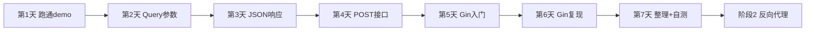

# 阶段 1：会写最简单的 Web 服务（2~3 周）

> 所属路线：[网关项目学习路线](./learning-roadmap.md)  
> 起点代码：[`go-minimal-demo/`](../go-minimal-demo/)  
> 原则：**先标准库理解原理，再用 Gin 贴近 README 项目**

---

## 阶段目标

搞懂这条链路：

```
浏览器 / curl 发请求 → 匹配 URL → 进入某个函数 → 返回响应
```

**结束时应达到**：不用看教程，能独立写一个小 API（3~5 个接口、JSON 格式、支持 GET / POST）。

---

## 进度对照

| 天 | 任务 | 状态 |
|----|------|------|
| 第 1 天 | 跑通 demo，改返回文字 | ⬜ |
| 第 2 天 | 加 `/time`、`/greet?name=张三` 接口 | ⬜ |
| 第 3 天 | 返回 JSON 而不是纯文字 | ⬜ |
| 第 4 天 | 加 POST 接口，接收 JSON | ⬜ |
| 第 5 天 | Gin 入门，跑通第一个 Gin 程序 | ⬜ |
| 第 6 天 | 用 Gin 复现所有接口 | ⬜ |
| 第 7 天 | 整理代码结构 + 自测毕业 | ⬜ |

完成一天勾一天，7 天全部打勾 = 可进入 [阶段 2](./learning-roadmap.md#阶段-2理解代理和中间件2-3-周)。

---

## 第 1 天：跑通 + 改文字

### 任务

1. 跑通 `go-minimal-demo`
2. 修改 `hello` 的返回文字
3. 理解 `main.go` 每一行的作用（可参考此前讲解）

### 命令

```powershell
cd d:\A_Software\Java\SAVE\Gateway\go-minimal-demo
go run .
```

另开终端验证：

```powershell
curl http://localhost:8080/hello
curl http://localhost:8080/
```

### 今天要搞懂的 3 件事

| 代码 | 含义 |
|------|------|
| `http.HandleFunc("/hello", hello)` | 路径和处理函数的绑定 |
| `func hello(w http.ResponseWriter, r *http.Request)` | 每个请求都会进这个函数 |
| `fmt.Fprint(w, "...")` | 把文字写进 HTTP 响应 Body |

### 练习

- 把 `"Hello, Go!"` 改成 `"你好，世界！"`
- 访问 `http://localhost:8080/xxx`，观察 404

### 检验标准

- [ ] 能独立启动和停止服务（Ctrl+C）
- [ ] 能解释 `HandleFunc` 和 `ListenAndServe` 的作用
- [ ] 知道 8080 端口冲突时如何排查

---

## 第 2 天：Query 参数

### 任务

新增两个接口：

- `GET /greet?name=张三` → 返回 `Hello, 张三!`
- `GET /time` → 返回当前时间

### 参考代码

在 `main.go` 中添加：

```go
import "time"

func greet(w http.ResponseWriter, r *http.Request) {
    name := r.URL.Query().Get("name")
    if name == "" {
        name = "World"
    }
    fmt.Fprintf(w, "Hello, %s!", name)
}

func timeNow(w http.ResponseWriter, r *http.Request) {
    fmt.Fprint(w, time.Now().Format("2006-01-02 15:04:05"))
}
```

在 `main()` 中注册：

```go
http.HandleFunc("/greet", greet)
http.HandleFunc("/time", timeNow)
```

### 验证

```powershell
curl "http://localhost:8080/greet?name=张三"
curl http://localhost:8080/greet
curl http://localhost:8080/time
```

### 今天要搞懂的

| 代码 | 含义 |
|------|------|
| `r.URL.Query().Get("name")` | 读取 URL 中 `?name=xxx` 的参数 |
| `if name == ""` | 没传参数时给默认值 |
| `time.Now().Format(...)` | 格式化当前时间 |

### 检验标准

- [ ] `/greet?name=张三` 返回正确
- [ ] 不传 `name` 时返回 `Hello, World!`
- [ ] `/time` 返回可读的时间字符串

---

## 第 3 天：返回 JSON

### 任务

把接口改成返回 JSON，采用统一响应格式：

```json
{
  "code": 0,
  "msg": "ok",
  "data": { ... }
}
```

### 参考代码

```go
import "encoding/json"

type Response struct {
    Code int    `json:"code"`
    Msg  string `json:"msg"`
    Data any    `json:"data,omitempty"`
}

func writeJSON(w http.ResponseWriter, statusCode int, resp Response) {
    w.Header().Set("Content-Type", "application/json; charset=utf-8")
    w.WriteHeader(statusCode)
    json.NewEncoder(w).Encode(resp)
}
```

改造 `hello`：

```go
func hello(w http.ResponseWriter, r *http.Request) {
    writeJSON(w, 200, Response{
        Code: 0,
        Msg:  "ok",
        Data: map[string]string{"text": "Hello, Go!"},
    })
}
```

同理改造 `greet`、`timeNow`。

### 验证

```powershell
curl http://localhost:8080/hello
```

应看到 JSON，而不是纯文字：

```json
{"code":0,"msg":"ok","data":{"text":"Hello, Go!"}}
```

### 今天要搞懂的

| 概念 | 含义 |
|------|------|
| `struct` | 定义数据结构 |
| `` `json:"code"` `` | 转成 JSON 时的字段名 |
| `Content-Type: application/json` | 告诉客户端响应是 JSON |
| `w.WriteHeader(200)` | 设置 HTTP 状态码 |
| 统一响应 `{code, msg, data}` | 后续网关、Java 服务都会沿用 |

### 检验标准

- [ ] 所有接口返回 JSON
- [ ] 浏览器 / curl 能正确解析
- [ ] 响应格式统一

---

## 第 4 天：POST + 接收 JSON

### 任务

新增 `POST /echo`：接收客户端 JSON，原样 echo 回去。

### 参考代码

```go
type EchoRequest struct {
    Message string `json:"message"`
}

func echo(w http.ResponseWriter, r *http.Request) {
    if r.Method != http.MethodPost {
        writeJSON(w, 405, Response{Code: 1, Msg: "method not allowed"})
        return
    }

    var req EchoRequest
    if err := json.NewDecoder(r.Body).Decode(&req); err != nil {
        writeJSON(w, 400, Response{Code: 1, Msg: "invalid json"})
        return
    }

    writeJSON(w, 200, Response{
        Code: 0,
        Msg:  "ok",
        Data: map[string]string{"echo": req.Message},
    })
}
```

注册：

```go
http.HandleFunc("/echo", echo)
```

### 验证

```powershell
curl -X POST http://localhost:8080/echo `
  -H "Content-Type: application/json" `
  -d '{"message":"你好"}'
```

### 今天要搞懂的

| 概念 | 含义 |
|------|------|
| `POST` | 客户端把数据放在 Body 里发过来 |
| `json.NewDecoder(r.Body).Decode(&req)` | 把 Body 解析成 Go 结构体 |
| `r.Method` | 判断是 GET 还是 POST |
| `400` | 客户端请求有误（如 JSON 格式错） |
| `405` | 方法不允许（如对 GET-only 接口发 POST） |

### 检验标准

- [ ] POST 正确 JSON 能 echo 回来
- [ ] 发 GET 到 `/echo` 返回 405
- [ ] 发错误 JSON 返回 400

---

## 第 5 天：Gin 入门

### 任务

新建 `go-gin-demo/`，用 Gin 框架跑通第一个程序。

### 初始化

```powershell
cd d:\A_Software\Java\SAVE\Gateway
mkdir go-gin-demo
cd go-gin-demo
go mod init example.com/gin-demo
go get github.com/gin-gonic/gin
```

### 最小 main.go

```go
package main

import "github.com/gin-gonic/gin"

func main() {
    r := gin.Default()

    r.GET("/hello", func(c *gin.Context) {
        c.JSON(200, gin.H{
            "code": 0,
            "msg":  "ok",
            "data": "Hello, Gin!",
        })
    })

    r.Run(":8080")
}
```

### 标准库 vs Gin 对照

| 标准库 `net/http` | Gin |
|-------------------|-----|
| `http.HandleFunc` | `r.GET` / `r.POST` |
| `w http.ResponseWriter` | `c *gin.Context` |
| 手写 JSON Header | `c.JSON(200, ...)` |
| `r.URL.Query().Get("name")` | `c.Query("name")` |
| 自己解析 POST Body | `c.ShouldBindJSON(&req)` |

### 验证

```powershell
go run .
curl http://localhost:8080/hello
```

### 检验标准

- [ ] Gin 项目能独立启动
- [ ] 能说出 Gin 比标准库方便了什么

---

## 第 6 天：Gin 复现所有接口

### 任务

在 `go-gin-demo` 中用 Gin 实现阶段 1 全部接口。

### 参考代码

```go
package main

import (
    "time"

    "github.com/gin-gonic/gin"
)

func main() {
    r := gin.Default()

    r.GET("/hello", func(c *gin.Context) {
        c.JSON(200, gin.H{
            "code": 0,
            "msg":  "ok",
            "data": map[string]string{"text": "Hello, Gin!"},
        })
    })

    r.GET("/", func(c *gin.Context) {
        c.JSON(200, gin.H{
            "code": 0,
            "msg":  "ok",
            "data": "Go server is running. Try /hello",
        })
    })

    r.GET("/greet", func(c *gin.Context) {
        name := c.DefaultQuery("name", "World")
        c.JSON(200, gin.H{
            "code": 0,
            "msg":  "ok",
            "data": "Hello, " + name + "!",
        })
    })

    r.GET("/time", func(c *gin.Context) {
        c.JSON(200, gin.H{
            "code": 0,
            "msg":  "ok",
            "data": time.Now().Format("2006-01-02 15:04:05"),
        })
    })

    r.POST("/echo", func(c *gin.Context) {
        var req struct {
            Message string `json:"message"`
        }
        if err := c.ShouldBindJSON(&req); err != nil {
            c.JSON(400, gin.H{"code": 1, "msg": "invalid json"})
            return
        }
        c.JSON(200, gin.H{
            "code": 0,
            "msg":  "ok",
            "data": map[string]string{"echo": req.Message},
        })
    })

    r.Run(":8080")
}
```

### 验证

```powershell
curl http://localhost:8080/hello
curl "http://localhost:8080/greet?name=张三"
curl http://localhost:8080/time
curl -X POST http://localhost:8080/echo -H "Content-Type: application/json" -d "{\"message\":\"test\"}"
```

### 检验标准

- [ ] 5 个接口全部可用
- [ ] 响应格式与标准库版一致

---

## 第 7 天：整理结构 + 毕业自测

### 任务

1. 把 handler 拆到独立文件，模拟真实项目结构
2. 跑完毕业自测清单

### 推荐目录结构

```
go-gin-demo/
├── main.go              # 启动 + 注册路由
├── handler/
│   └── api.go           # 各接口处理函数
├── model/
│   └── response.go      # Response 结构体
└── go.mod
```

### `model/response.go`

```go
package model

type Response struct {
    Code int    `json:"code"`
    Msg  string `json:"msg"`
    Data any    `json:"data,omitempty"`
}
```

### `handler/api.go`

```go
package handler

import (
    "time"

    "example.com/gin-demo/model"
    "github.com/gin-gonic/gin"
)

func Hello(c *gin.Context) {
    c.JSON(200, model.Response{
        Code: 0, Msg: "ok",
        Data: map[string]string{"text": "Hello, Gin!"},
    })
}

// ... 其余 handler 同理
```

### `main.go`

```go
package main

import (
    "example.com/gin-demo/handler"
    "github.com/gin-gonic/gin"
)

func main() {
    r := gin.Default()
    r.GET("/hello", handler.Hello)
    r.GET("/greet", handler.Greet)
    r.GET("/time", handler.Time)
    r.POST("/echo", handler.Echo)
    r.Run(":8080")
}
```

### 毕业自测清单

```powershell
# 1. 正常接口
curl http://localhost:8080/hello
curl "http://localhost:8080/greet?name=张三"
curl http://localhost:8080/time

# 2. POST
curl -X POST http://localhost:8080/echo -H "Content-Type: application/json" -d "{\"message\":\"test\"}"

# 3. 错误场景
curl http://localhost:8080/notfound          # 期望 404
curl -X GET http://localhost:8080/echo     # 若只注册 POST，期望 404
curl -X POST http://localhost:8080/echo -d "not-json"  # 期望 400
```

### 检验标准

- [ ] 代码按包拆分，结构清晰
- [ ] 毕业自测全部通过
- [ ] 能不看文档独立讲出请求处理流程

---

## 阶段 1 结束标准（总 checklist）

- [ ] 能独立写 3~5 个接口，不抄教程
- [ ] GET 能读 query 参数（`?name=xxx`）
- [ ] 响应是 JSON，格式统一 `{code, msg, data}`
- [ ] POST 能接收 JSON Body
- [ ] 标准库版和 Gin 版都写过
- [ ] 能解释：请求从进入到返回，经过了哪些代码

**全部打勾 → 进入阶段 2：Gin 反向代理（第一个迷你网关）**

---

## 推荐资源

| 资源 | 链接 | 用途 |
|------|------|------|
| Go 官方 Tour | https://go.dev/tour/zh/welcome/1 | 语言基础（第 1~4 天抽空看） |
| Gin 官方文档 | https://gin-gonic.com/docs/ | 第 5~7 天 |
| MDN HTTP | https://developer.mozilla.org/zh-CN/docs/Web/HTTP | 理解 GET/POST/状态码 |
| 本地 demo | `go-minimal-demo/` | 第 1~4 天练习 |
| Gin demo | `go-gin-demo/`（第 5 天创建） | 第 5~7 天练习 |

---

## 常见问题

### Q：标准库和 Gin 都要学吗？

建议都写一遍：标准库帮你理解底层；Gin 是 README 网关项目用的框架。

### Q：8080 端口被占用怎么办？

```powershell
netstat -ano | findstr :8080
taskkill /PID <进程号> /F
```

或把 `:8080` 改成 `:8081`。

### Q：一天完不成怎么办？

不必严格一天；按顺序做完 7 个模块即可，2~3 周是参考周期。

### Q：完成后做什么？

进入 [阶段 2](./phase2-proxy-middleware.md)：

- 启动两个服务（8080 网关 + 9001 下游）
- 用 Gin + `httputil.ReverseProxy` 做第一个反向代理

---

## 学习流程图


