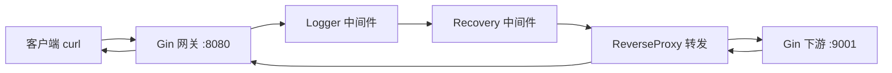
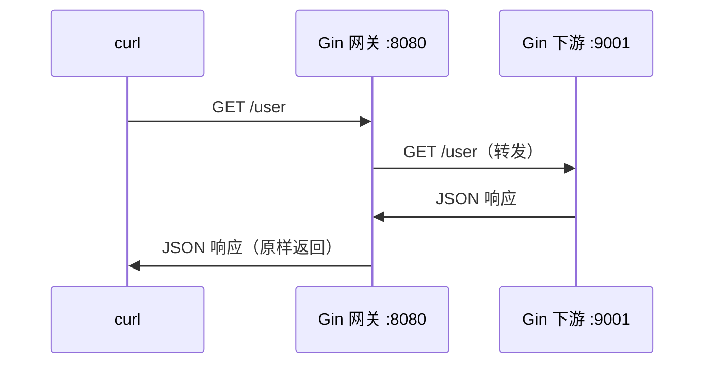
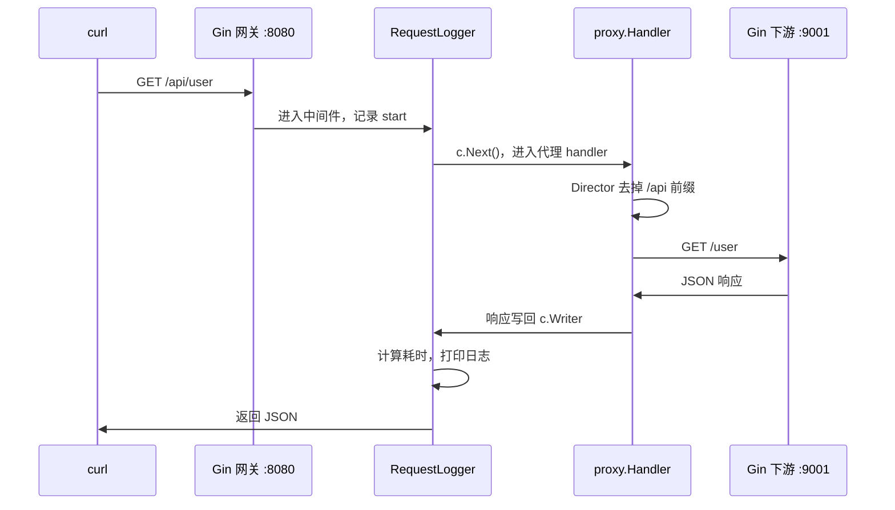
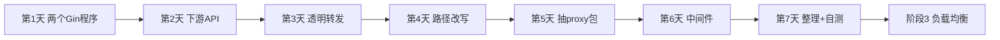

# 阶段 2：理解「代理」和「中间件」（2~3 周）

> 所属路线：[网关项目学习路线](./learning-roadmap.md)  
> 前置要求：完成 [阶段 1](./phase1-web-service.md)（Gin API 能跑通）  
> 起点代码：[`go-minimal-demo/`](../go-minimal-demo/)（阶段 1 成果）  
> 本阶段新建：[`go-proxy-demo/`](../go-proxy-demo/)（第 1 天创建）  
> 原则：**全程 Gin，与 README 网关项目一致**（转发底层用 `httputil.ReverseProxy`，路由和中间件不手写 `net/http`）

---

## 阶段目标

搞懂这条链路：

```
浏览器 / curl → Gin 网关 :8080 → （中间件）→ 转发 → Gin 下游 :9001 → 响应原路返回
```

**结束时应达到**：能独立启动网关 + 下游两个 Gin 程序，8080 把 `/api/*` 转发到 9001，并在转发前加日志中间件。

---

## 和 README 的关系

README 里的网关，核心就是下面这件事：

```
用户 → 网关 :8080 → 下游服务 :9001
```

用户访问 `http://localhost:8080/api/user`，网关转发到 `http://localhost:9001/user`。  
用户只认识 8080，不知道 9001 的存在——这就是**反向代理**。

搞懂这一步，README 就懂了一半。阶段 3 才会在此基础上加负载均衡、JWT、Redis 限流等。

---

## 进度对照

| 天 | 任务 | 状态 |
|----|------|------|
| 第 1 天 | 理解反向代理概念，同时跑两个 Gin 程序 | ⬜ |
| 第 2 天 | 完善下游服务（9001），提供 3 个 API | ⬜ |
| 第 3 天 | Gin 网关 + `ReverseProxy` 透明转发 | ⬜ |
| 第 4 天 | 路径前缀改写（`/api/user` → `/user`） | ⬜ |
| 第 5 天 | 抽取 `proxy` 包，整理 gateway 代码 | ⬜ |
| 第 6 天 | 中间件：日志 + 请求耗时 | ⬜ |
| 第 7 天 | 整理项目结构 + 毕业自测 | ⬜ |

完成一天勾一天，7 天全部打勾 = 可进入 [阶段 3](./phase3-readme-features.md)。

---

## 架构一览



| 角色 | 端口 | 框架 | 职责 |
|------|------|------|------|
| **网关（Gateway）** | 8080 | Gin | 对外唯一入口，中间件，转发请求 |
| **下游（Downstream）** | 9001 | Gin | 真正处理业务，客户端不可见 |

> **说明**：路由注册、JSON 响应、中间件全部用 Gin；`httputil.ReverseProxy` 只负责「把请求转给下游」，封装在 `proxy` 包里，日常写网关代码时接触的都是 `*gin.Context`。

---

## 第 1 天：理解反向代理 + 跑两个 Gin 程序

### 任务

1. 搞懂「正向代理」和「反向代理」的区别
2. 用 Gin 同时启动两个程序（8080 和 9001）
3. 分别用 curl 访问，确认互不干扰

### 概念（3 分钟读懂）

| 类型 | 谁不知道谁 | 例子 |
|------|-----------|------|
| **正向代理** | 服务器不知道真实客户端 | VPN、公司内网上网代理 |
| **反向代理** | 客户端不知道真实服务器 | Nginx、本项目的网关 |

本项目的网关就是反向代理：**客户端只和 8080 说话，8080 替它去找 9001**。

### 初始化项目

```powershell
cd d:\A_Software\Java\SAVE\Gateway
mkdir go-proxy-demo
cd go-proxy-demo
go mod init example.com/proxy-demo
go get github.com/gin-gonic/gin
```

### 推荐目录

```
go-proxy-demo/
├── cmd/
│   ├── downstream/main.go    # 下游 :9001
│   └── gateway/main.go       # 网关 :8080
└── go.mod
```

### 参考代码 — `cmd/downstream/main.go`

```go
package main

import (
    "log"

    "github.com/gin-gonic/gin"
)

func main() {
    r := gin.Default()

    r.GET("/user", func(c *gin.Context) {
        c.JSON(200, gin.H{
            "code": 0, "msg": "ok",
            "data": gin.H{"name": "张三", "from": "downstream-9001"},
        })
    })

    log.Println("downstream listening on :9001")
    r.Run(":9001")
}
```

### 参考代码 — `cmd/gateway/main.go`（今天先不转发）

```go
package main

import (
    "log"

    "github.com/gin-gonic/gin"
)

func main() {
    r := gin.Default()

    r.GET("/", func(c *gin.Context) {
        c.JSON(200, gin.H{
            "code": 0, "msg": "ok",
            "data": "gateway :8080 is running. Downstream is on :9001",
        })
    })

    log.Println("gateway listening on :8080")
    r.Run(":8080")
}
```

### 命令

```powershell
# 终端 1
cd d:\A_Software\Java\SAVE\Gateway\go-proxy-demo
go run ./cmd/downstream

# 终端 2（新开）
go run ./cmd/gateway
```

### 验证

```powershell
curl.exe http://localhost:8080/
curl.exe http://localhost:9001/user
```

两个都应返回 JSON 200，且内容不同——说明两个独立 Gin 进程在各自端口上运行。

### 今天要搞懂的

| 概念 | 含义 |
|------|------|
| 两个 `go run` | 两个独立进程，各占一个端口 |
| `gin.Default()` | 创建引擎 + Logger/Recovery 中间件 |
| `r.Run(":8080")` | 启动 HTTP 服务（底层仍是 net/http，但你只写 Gin） |
| 反向代理 | 用户只访问 8080，由 8080 代为请求 9001 |

### 检验标准

- [ ] 能同时启动 8080 和 9001 两个 Gin 程序
- [ ] 能说出反向代理和正向代理的区别
- [ ] 知道为什么需要两个终端

---

## 第 2 天：完善下游服务

### 任务

给 9001 下游补充 3 个业务接口，模拟真实微服务。

### 参考代码 — `cmd/downstream/main.go`

```go
package main

import (
    "log"

    "github.com/gin-gonic/gin"
)

func main() {
    r := gin.Default()

    r.GET("/user", func(c *gin.Context) {
        c.JSON(200, gin.H{
            "code": 0, "msg": "ok",
            "data": gin.H{"name": "张三", "role": "user"},
        })
    })

    r.GET("/order", func(c *gin.Context) {
        c.JSON(200, gin.H{
            "code": 0, "msg": "ok",
            "data": gin.H{"orderId": "ORD-001", "amount": 99.9},
        })
    })

    r.GET("/health", func(c *gin.Context) {
        c.JSON(200, gin.H{"code": 0, "msg": "ok", "data": "healthy"})
    })

    log.Println("downstream listening on :9001")
    r.Run(":9001")
}
```

### 验证

```powershell
go run ./cmd/downstream

curl.exe http://localhost:9001/user
curl.exe http://localhost:9001/order
curl.exe http://localhost:9001/health
```

### 今天要搞懂的

| 概念 | 含义 |
|------|------|
| 下游服务 | 真正干活的微服务，网关后面可以有多个 |
| `/health` | 健康检查接口，后续负载均衡会用到 |
| 统一 `{code, msg, data}` | 与阶段 1 保持一致，方便对比 |

### 检验标准

- [ ] 下游 3 个接口全部可用
- [ ] 响应是 JSON 格式
- [ ] 能解释：这些接口将来只通过网关对外暴露

---

## 第 3 天：Gin 反向代理初体验

### 任务

在 Gin 网关里接入 `httputil.ReverseProxy`，把请求**原样**转发到 9001（路径不变）。

### 核心概念

```
客户端  GET /user  →  Gin 网关  →  GET /user  →  下游 9001/user
```

今天先做透明转发，第 4 天再加 `/api` 前缀剥离。

### 参考代码 — `cmd/gateway/main.go`

```go
package main

import (
    "log"
    "net/http/httputil"
    "net/url"

    "github.com/gin-gonic/gin"
)

func newProxy(target string) gin.HandlerFunc {
    remote, _ := url.Parse(target)
    proxy := httputil.NewSingleHostReverseProxy(remote)

    return func(c *gin.Context) {
        proxy.ServeHTTP(c.Writer, c.Request)
    }
}

func main() {
    r := gin.Default()

    // 所有请求转发到下游（路径不变）
    r.Any("/*path", newProxy("http://localhost:9001"))

    log.Println("gateway listening on :8080, proxy to :9001")
    r.Run(":8080")
}
```

### 关键对照（阶段 1 → 阶段 2）

| 阶段 1 写法 | 阶段 2 写法 |
|------------|------------|
| `c.JSON(200, resp)` 自己处理 | `proxy.ServeHTTP(c.Writer, c.Request)` 转给下游 |
| handler 返回业务数据 | handler 只做转发，业务在 9001 |
| `r.GET("/hello", handler.Hello)` | `r.Any("/*path", newProxy(...))` |

### 命令

```powershell
# 终端 1：下游
go run ./cmd/downstream

# 终端 2：网关
go run ./cmd/gateway
```

### 验证

```powershell
# 访问 8080，实际由 9001 处理
curl.exe http://localhost:8080/user
curl.exe http://localhost:8080/order
curl.exe http://localhost:8080/health
```

返回内容应与直接访问 9001 一致，但你是通过 8080 访问的。

### 今天要搞懂的

| 代码 | 含义 |
|------|------|
| `httputil.NewSingleHostReverseProxy(remote)` | 创建反向代理，README 项目 HTTP 转发的核心 |
| `proxy.ServeHTTP(c.Writer, c.Request)` | 把 Gin 收到的请求转出去，响应写回 `c.Writer` |
| `r.Any(...)` | 支持 GET / POST / PUT 等所有 HTTP 方法 |
| `c.Writer` / `c.Request` | Gin 对标准库读写器的封装，供 ReverseProxy 使用 |

### 请求流转



### 检验标准

- [ ] 访问 8080/user 得到与 9001/user 相同的数据
- [ ] 能解释 `ReverseProxy` 和 Gin handler 如何配合
- [ ] 能画出上面的时序图

---

## 第 4 天：路径前缀改写

### 任务

对外暴露 `/api/*`，转发时去掉 `/api` 前缀，并保留网关自身接口。

```
GET /api/user  →  Gin 网关  →  GET /user  →  下游 9001
GET /gateway/health  →  网关自己处理，不转发
```

这是 README 网关的典型 URL 规则。

### 参考代码 — `cmd/gateway/main.go`

```go
package main

import (
    "log"
    "net/http"
    "net/http/httputil"
    "net/url"
    "strings"

    "github.com/gin-gonic/gin"
)

func newProxy(target string) gin.HandlerFunc {
    remote, _ := url.Parse(target)
    proxy := httputil.NewSingleHostReverseProxy(remote)

    // 转发前去掉 /api 前缀
    originalDirector := proxy.Director
    proxy.Director = func(req *http.Request) {
        originalDirector(req)
        req.URL.Path = strings.TrimPrefix(req.URL.Path, "/api")
        if req.URL.Path == "" {
            req.URL.Path = "/"
        }
    }

    return func(c *gin.Context) {
        proxy.ServeHTTP(c.Writer, c.Request)
    }
}

func main() {
    r := gin.Default()

    // 网关自身接口（不转发）
    r.GET("/gateway/health", func(c *gin.Context) {
        c.JSON(200, gin.H{"code": 0, "msg": "ok", "data": "gateway healthy"})
    })

    // 所有 /api/* 请求转发到下游
    r.Any("/api/*path", newProxy("http://localhost:9001"))

    log.Println("gateway listening on :8080")
    r.Run(":8080")
}
```

### 验证

```powershell
# 通过 /api 前缀访问下游
curl.exe http://localhost:8080/api/user
curl.exe http://localhost:8080/api/order

# 网关自身接口
curl.exe http://localhost:8080/gateway/health

# 直接访问 /user 应 404（没有注册该路由）
curl.exe http://localhost:8080/user
```

### 今天要搞懂的

| 概念 | 含义 |
|------|------|
| `Director` | 转发前修改请求的钩子，可改 Path、Header |
| `strings.TrimPrefix` | 去掉 URL 前缀 `/api` |
| `/gateway/health` | 网关自己的接口，与代理路由分开注册 |
| `r.Any("/api/*path", ...)` | Gin 路由匹配所有 `/api/` 开头的请求 |
| URL 重写 | README 中「支持 URL 重写」的基础 |

### 检验标准

- [ ] `/api/user` 能正确转发到下游 `/user`
- [ ] `/gateway/health` 由网关自己处理，不转发
- [ ] 能解释 `Director` 的作用

---

## 第 5 天：抽取 proxy 包

### 任务

把 `newProxy` 从 `main.go` 抽到独立包，让 `main.go` 只负责启动和注册路由——与阶段 1 拆 handler 的思路一致。

### 推荐目录

```
go-proxy-demo/
├── cmd/
│   ├── gateway/main.go
│   └── downstream/main.go
├── gateway/
│   └── proxy/
│       └── reverse.go        # ReverseProxy 封装
└── go.mod
```

### 参考代码 — `gateway/proxy/reverse.go`

```go
package proxy

import (
    "net/http/httputil"
    "net/url"
    "strings"

    "github.com/gin-gonic/gin"
)

func Handler(target string) gin.HandlerFunc {
    remote, _ := url.Parse(target)
    p := &httputil.ReverseProxy{
        Rewrite: func(pr *httputil.ProxyRequest) {
            pr.SetURL(remote)
            pr.Out.URL.Path = strings.TrimPrefix(pr.In.URL.Path, "/api")
            if pr.Out.URL.Path == "" {
                pr.Out.URL.Path = "/"
            }
        },
    }

    return func(c *gin.Context) {
        p.ServeHTTP(c.Writer, c.Request)
    }
}
```

### 参考代码 — `cmd/gateway/main.go`

```go
package main

import (
    "log"

    "go-proxy-demo/gateway/proxy"
    "github.com/gin-gonic/gin"
)

func main() {
    r := gin.Default()

    r.GET("/gateway/health", func(c *gin.Context) {
        c.JSON(200, gin.H{"code": 0, "msg": "ok", "data": "gateway healthy"})
    })

    r.Any("/api/*path", proxy.Handler("http://localhost:9001"))

    log.Println("gateway listening on :8080")
    r.Run(":8080")
}
```

### 检验标准

- [ ] `main.go` 只有路由注册，不含转发细节
- [ ] 功能与第 4 天完全一致
- [ ] 能说出「main 管路由，proxy 管转发」的分工

---

## 第 6 天：中间件

### 任务

在转发之前加自定义 Gin 中间件：打印请求日志、统计耗时。  
理解 README 里「中间件链」的雏形。

### 中间件模型（洋葱）

```
请求进入
  → Recovery（panic 恢复）
  → RequestLogger（计时 + 打日志）
  → ReverseProxy（转发）
  → 响应返回
  → RequestLogger（打印耗时）
```

### 参考代码 — `gateway/middleware/logger.go`

```go
package middleware

import (
    "log"
    "time"

    "github.com/gin-gonic/gin"
)

func RequestLogger() gin.HandlerFunc {
    return func(c *gin.Context) {
        start := time.Now()
        path := c.Request.URL.Path

        c.Next() // 继续执行后续 handler（含 ReverseProxy）

        latency := time.Since(start)
        log.Printf("[%s] %s %s → %d (%v)",
            c.Request.Method, path, c.ClientIP(), c.Writer.Status(), latency)
    }
}
```

### 参考代码 — `cmd/gateway/main.go`

```go
package main

import (
    "log"
    "strings"

    "example.com/proxy-demo/gateway/middleware"
    "example.com/proxy-demo/gateway/proxy"
    "github.com/gin-gonic/gin"
)

func main() {
    r := gin.New()                     // 不用 Default，手动挂中间件
    r.Use(gin.Recovery())              // panic 恢复
    r.Use(middleware.RequestLogger())    // 自定义日志
    r.Use(middleware.BlockInternal())    // 拦截内部路径（练习）

    r.GET("/gateway/health", func(c *gin.Context) {
        c.JSON(200, gin.H{"code": 0, "msg": "ok", "data": "gateway healthy"})
    })

    r.Any("/api/*path", proxy.Handler("http://localhost:9001"))

    log.Println("gateway listening on :8080")
    r.Run(":8080")
}
```

### 练习 — `gateway/middleware/block.go`

```go
package middleware

import (
    "strings"

    "github.com/gin-gonic/gin"
)

func BlockInternal() gin.HandlerFunc {
    return func(c *gin.Context) {
        if strings.HasPrefix(c.Request.URL.Path, "/api/internal") {
            c.JSON(403, gin.H{"code": 1, "msg": "forbidden"})
            c.Abort()
            return
        }
        c.Next()
    }
}
```

访问 `/api/internal/xxx` 应返回 403，不转发到下游——这是黑白名单的雏形。

### 验证

```powershell
curl.exe http://localhost:8080/api/user
```

终端应看到类似日志：

```
[GET] /api/user 127.0.0.1 → 200 (2.5ms)
```

### 今天要搞懂的

| 概念 | 含义 |
|------|------|
| `gin.New()` vs `gin.Default()` | `New` 不自动挂中间件，完全自己控制 |
| `r.Use(middleware)` | 全局中间件，所有路由都会经过 |
| `c.Next()` | 调用下一个 handler，等它返回后再继续 |
| `c.Abort()` | 中断链条，不再往下走（鉴权失败时用） |
| 中间件链 | 阶段 3 会扩展为：鉴权 → 限流 → 转发 → 审计 |

### 检验标准

- [ ] 每次请求终端有日志输出
- [ ] 日志包含：方法、路径、状态码、耗时
- [ ] 能解释 `c.Next()` 和 `c.Abort()` 的区别
- [ ] `/api/internal/xxx` 被拦截返回 403

---

## 第 7 天：整理结构 + 毕业自测

### 任务

1. 确认最终目录结构清晰
2. 跑完毕业自测清单
3. 能独立讲出「请求从进入到返回」的完整链路

### 最终目录结构

```
go-proxy-demo/
├── cmd/
│   ├── gateway/
│   │   └── main.go           # 启动 + 注册路由 + 挂中间件
│   └── downstream/
│       └── main.go           # 下游微服务
├── gateway/
│   ├── middleware/
│   │   ├── logger.go         # 日志中间件
│   │   └── block.go          # 拦截中间件（练习）
│   └── proxy/
│       └── reverse.go        # ReverseProxy 封装
└── go.mod
```

### 毕业自测清单

```powershell
# 终端 1
cd d:\A_Software\Java\SAVE\Gateway\go-proxy-demo
go run ./cmd/downstream

# 终端 2
go run ./cmd/gateway

# 1. 下游直连（确认下游正常）
curl.exe http://localhost:9001/user
curl.exe http://localhost:9001/health

# 2. 经网关转发
curl.exe http://localhost:8080/api/user
curl.exe http://localhost:8080/api/order
curl.exe http://localhost:8080/api/health

# 3. 网关自身接口
curl.exe http://localhost:8080/gateway/health

# 4. 中间件拦截
curl.exe http://localhost:8080/api/internal/secret   # 期望 403

# 5. 错误场景
curl.exe http://localhost:8080/api/notexist     # 下游 404
curl.exe http://localhost:8080/notexist         # 网关 404
# 先停掉 downstream，再访问：
curl.exe http://localhost:8080/api/user         # 期望 502 或连接错误
```

### 请求完整链路（自测要能讲出来）



**文字版**：

1. curl 向 `:8080/api/user` 发请求
2. Gin 路由匹配 `r.Any("/api/*path", proxy.Handler(...))`
3. 进入 `RequestLogger` 中间件，记录开始时间
4. `c.Next()` 进入 `proxy.Handler`
5. `Director` 把路径从 `/api/user` 改成 `/user`
6. `ReverseProxy` 向 `localhost:9001/user` 发请求
7. 下游 Gin 返回 JSON，代理原样写回客户端
8. 中间件打印 `[GET] /api/user → 200 (2ms)`

### 检验标准

- [ ] 代码按包拆分，结构清晰
- [ ] 毕业自测全部通过
- [ ] 能不看文档讲出上面的 8 步流程
- [ ] 能画出一幅「请求经过网关到下游」的流程图

---

## 阶段 2 结束标准（总 checklist）

- [ ] 能同时启动两个 Gin 程序（8080 网关 + 9001 下游）
- [ ] 8080 能把 `/api/*` 转发到 9001，并正确剥离 `/api` 前缀
- [ ] 理解 `proxy.Handler` + `ReverseProxy` 的作用
- [ ] 能在转发前加自定义 Gin 中间件（日志、拦截）
- [ ] 能解释 `c.Next()` / `c.Abort()` 的区别
- [ ] 能画出一幅完整的请求流转图

**全部打勾 → 进入阶段 3：负载均衡 → JWT 鉴权 → Redis 限流 → 服务注册**

---

## 推荐资源

| 资源 | 链接 | 用途 |
|------|------|------|
| Gin 官方文档 | https://gin-gonic.com/docs/ | 路由、中间件 |
| Gin 自定义中间件 | https://gin-gonic.com/docs/examples/custom-middleware/ | 第 6 天 |
| ReverseProxy 文档 | https://pkg.go.dev/net/http/httputil#ReverseProxy | 理解转发原理（封装在 proxy 包里） |
| MDN 反向代理 | https://developer.mozilla.org/zh-CN/docs/Web/HTTP/Guides/Proxy_servers_and_tunneling | 概念理解 |
| 阶段 1 成果 | `go-minimal-demo/` | Gin 基础参考 |
| 本阶段项目 | `go-proxy-demo/` | 第 1~7 天练习 |

---

## 常见问题

### Q：访问 8080 返回 502 Bad Gateway？

下游没启动。先 `go run ./cmd/downstream`，再访问网关。

### Q：8080 和 9001 端口冲突？

```powershell
netstat -ano | findstr :8080
netstat -ano | findstr :9001
taskkill /PID <进程号> /F
```

### Q：为什么要去掉 `/api` 前缀？

对外统一加 `/api` 表示「这是 API 请求」；下游微服务不需要知道这个前缀，各服务只关心 `/user`、`/order`。

### Q：为什么还要用 `httputil.ReverseProxy`？

Gin 没有内置反向代理，README 项目也是用标准库的 `ReverseProxy` 做 HTTP 转发。  
区别在于：**路由、中间件、JSON 响应全部用 Gin**；`ReverseProxy` 只封装在 `gateway/proxy/` 里，你日常写的是 `r.Any(...)` 和 `r.Use(...)`。

### Q：和 Nginx 反向代理有什么区别？

原理一样：都是接收请求、转发到后端、返回响应。Go 网关的优势是可以用 Gin 中间件写鉴权、限流、负载均衡，更灵活。

### Q：完成后做什么？

进入 [阶段 3](./phase3-readme-features.md)：

- ① 负载均衡：下游从 1 个变成 3 个，网关轮询选择
- ② JWT 鉴权：中间件检查 Token，无效则 401
- ③ Redis 限流：令牌桶算法控制 QPS

---

## 学习流程图


