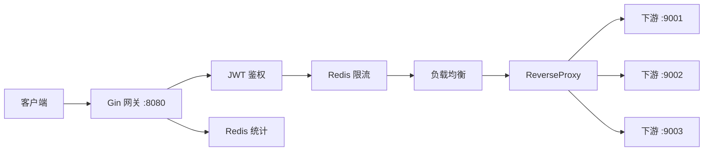
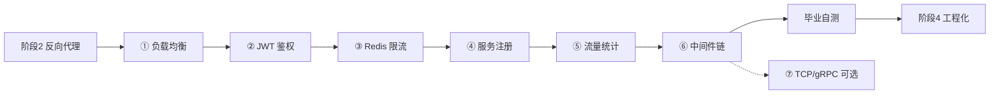

# 阶段 3：逐个攻克 README 功能（1~2 个月）

> 所属路线：[网关项目学习路线](./learning-roadmap.md)  
> 前置要求：完成 [阶段 2](./phase2-proxy-middleware.md)（反向代理 + Gin 中间件能跑通）  
> 起点代码：[`go-proxy-demo/`](../go-proxy-demo/)（阶段 2 成果）  
> 本阶段目标：在 `go-proxy-demo` 基础上**逐步扩展为网关雏形**（鉴权 + 限流 + LB + 服务注册），而不是零散的 example  
> 原则：**一次只学一个，单独跑通、单独测试，再拼到一起**  
> 逐模块详细教程（每日任务、代码、验证）→ **[phase3/ 目录](./phase3/README.md)**

---

## 阶段目标

在阶段 2「单下游 + 转发 + 日志中间件」之上，逐个实现 README 描述的核心能力：

```
浏览器 / curl → Gin 网关 :8080
  → 鉴权（JWT）
  → 限流（Redis 令牌桶）
  → 负载均衡（多下游选一台）
  → ReverseProxy 转发
  → 流量统计（Redis 计数）
  → 响应返回
```

**结束时应达到**：有一个能跑的单体网关雏形——鉴权 + 限流 + 轮询 LB + 动态服务注册 + Redis 流量统计 + 完整中间件链。

---

## 和 README 的关系

| README 功能 | 本阶段对应模块 | 说明 |
|-------------|----------------|------|
| 四种负载均衡 | ① 负载均衡 | 先掌握随机 / 轮询，加权轮询与一致性 Hash 为进阶 |
| Bearer JWT + 租户 | ② JWT 鉴权 | 内存租户列表，Issuer 匹配 |
| Redis 令牌桶 QPS/QPD | ③ Redis 限流 | 单机 Redis 即可 |
| 动态注册 / 下线 | ④ 服务注册 | 内存维护节点列表，更新 LB |
| Redis 流量统计 | ⑤ 流量统计 | 按租户 / 路径计数 |
| 中间件链 | ⑥ 中间件链 | 鉴权 → 限流 → 转发 → 审计 |
| TCP / gRPC 代理 | ⑦ 可选 | HTTP：[07-tcp-grpc](./07-tcp-grpc.md) · gRPC：[../gRPC/README.md](../gRPC/README.md) |

README 描述的是**终点**；本阶段完成后，你就有了 HTTP 网关的**项目雏形**，阶段 4 再做 Vue Admin、Docker、压测。

---

## 进度对照

| 模块 | 详细教程 | 预计 | 状态 |
|------|----------|------|------|
| **① 负载均衡** | [phase3/01-load-balancer.md](./phase3/01-load-balancer.md) | 3~5 天 | ⬜ |
| **② JWT 鉴权** | [phase3/02-jwt-auth.md](./phase3/02-jwt-auth.md) | 3~5 天 | ⬜ |
| **③ Redis 限流** | [phase3/03-redis-ratelimit.md](./phase3/03-redis-ratelimit.md) | 1 周 | ⬜ |
| **④ 服务注册** | [phase3/04-service-registry.md](./phase3/04-service-registry.md) | 3~5 天 | ⬜ |
| **⑤ 流量统计** | [phase3/05-traffic-stats.md](./phase3/05-traffic-stats.md) | 3~5 天 | ⬜ |
| **⑥ 中间件链** | [phase3/06-middleware-chain.md](./phase3/06-middleware-chain.md) | 1 周 | ⬜ |
| **⑦ TCP/gRPC** | TCP：[07-tcp-grpc.md](./07-tcp-grpc.md) · gRPC 详版：[../gRPC/README.md](../gRPC/README.md) | 各 1~2 周 | ⬜ |

完成 ①~⑥ 全部打勾 = 可进入 [阶段 4](./learning-roadmap.md#阶段-4工程化可选项目收尾)（Vue Admin、Docker、压测）。

---

## 架构演进



| 角色 | 端口 | 职责 |
|------|------|------|
| **网关** | 8080 | 中间件链、LB、转发、管理 API |
| **下游 × N** | 9001 / 9002 / 9003 | 业务处理，响应中带 `instance` 标识 |
| **Redis** | 6379 | 限流计数、流量统计 |

---

## 推荐最终目录

在 `go-proxy-demo/` 上扩展（也可复制为 `go-gateway/`，模块名自行调整）：

```
go-proxy-demo/
├── cmd/
│   ├── gateway/main.go          # 启动 + 挂中间件链 + 管理 API
│   └── downstream/main.go       # 下游（--port 9001/9002/9003）
├── gateway/
│   ├── middleware/
│   │   ├── logger.go            # 阶段 2 已有
│   │   ├── block.go             # 阶段 2 已有 → 演进为黑白名单
│   │   ├── auth.go              # JWT 鉴权
│   │   ├── ratelimit.go         # Redis 限流
│   │   └── stats.go             # 流量统计（转发后记录）
│   ├── proxy/
│   │   └── reverse.go           # 接入 LB 选节点
│   ├── lb/
│   │   ├── balancer.go          # 接口定义
│   │   ├── random.go
│   │   └── roundrobin.go
│   ├── registry/
│   │   └── memory.go            # 内存服务注册
│   ├── tenant/
│   │   └── store.go             # 内存租户列表
│   └── redis/
│       └── client.go            # Redis 连接封装
└── go.mod
```

**原则**：每完成一个模块，目录多一个包；`main.go` 只负责组装，不写业务细节。

---

## 模块详细教程

每个模块含「逐日任务、概念、参考代码、验证命令、检验标准」，风格与 [阶段 2](./phase2-proxy-middleware.md) 一致：

| 模块 | 链接 |
|------|------|
| ① 负载均衡 | [phase3/01-load-balancer.md](./phase3/01-load-balancer.md) |
| ② JWT 鉴权 | [phase3/02-jwt-auth.md](./phase3/02-jwt-auth.md) |
| ③ Redis 限流 | [phase3/03-redis-ratelimit.md](./phase3/03-redis-ratelimit.md) |
| ④ 服务注册 | [phase3/04-service-registry.md](./phase3/04-service-registry.md) |
| ⑤ 流量统计 | [phase3/05-traffic-stats.md](./phase3/05-traffic-stats.md) |
| ⑥ 中间件链 | [phase3/06-middleware-chain.md](./phase3/06-middleware-chain.md) |
| ⑦ TCP/gRPC | [phase3/07-tcp-grpc.md](./phase3/07-tcp-grpc.md) |

---

## 毕业自测清单

```powershell
cd d:\A_Software\Java\SAVE\Gateway\go-proxy-demo

# 0. 依赖
docker start redis   # 或 docker run ...（见 ③）

# 1. 启动 3 个下游
go run ./cmd/downstream --port 9001
go run ./cmd/downstream --port 9002
go run ./cmd/downstream --port 9003

# 2. 启动网关
go run ./cmd/gateway

# 3. 鉴权
curl.exe http://localhost:8080/api/user                                    # 401
curl.exe -H "Authorization: Bearer <token>" http://localhost:8080/api/user # 200

# 4. 负载均衡
1..6 | ForEach-Object { curl.exe -s -H "Authorization: Bearer <token>" http://localhost:8080/api/user }

# 5. 限流
1..15 | ForEach-Object { curl.exe -s -o NUL -w "%{http_code}\n" -H "Authorization: Bearer <token>" http://localhost:8080/api/user }

# 6. 服务注册
curl.exe -X POST http://localhost:8080/gateway/services -H "Content-Type: application/json" -d "{\"url\":\"http://localhost:9004\"}"

# 7. 流量统计
curl.exe http://localhost:8080/gateway/stats?tenant=tenant-a

# 8. 黑白名单
curl.exe -H "Authorization: Bearer <token>" http://localhost:8080/api/internal/secret  # 403

# 9. 网关健康（不鉴权）
curl.exe http://localhost:8080/gateway/health
```

### 请求完整链路（自测要能讲出来）

1. curl 带 Bearer Token 访问 `:8080/api/user`
2. `JWTAuth` 解析 Token，校验 `iss` 在租户列表
3. `RateLimit` 检查 Redis 计数，未超限则继续
4. `BlockList` 检查路径是否在黑名单
5. `Balancer.Next()` 选出 `http://localhost:9002`
6. `ReverseProxy` 去掉 `/api` 前缀，转发到 `9002/user`
7. `Stats` 对租户请求量 +1
8. `RequestLogger` 打印 `[GET] /api/user → 200 (3ms)`

---

## 阶段 3 结束标准（总 checklist）

- [ ] 有能跑的单体网关：鉴权 + 限流 + 转发 + 轮询 LB
- [ ] 动态服务注册 / 下线可用
- [ ] Redis 流量统计可用
- [ ] 中间件链：鉴权 → 限流 → 转发 → 审计（含黑白名单或简单熔断）
- [ ] 能不看文档讲出完整请求链路
- [ ] 代码按包拆分，不是全堆在 `main.go`

**全部打勾 → 进入阶段 4：Vue Admin、Docker、wrk 压测**

---

## 各功能难度参考

| 策略 / 功能 | 难度 | 本阶段建议 |
|-------------|------|------------|
| 随机负载均衡 | ⭐ | 必做 |
| 轮询负载均衡 | ⭐ | 必做 |
| 加权轮询 | ⭐⭐ | 有余力再做 |
| 一致性 Hash | ⭐⭐⭐ | 可后做 |
| JWT 解析 | ⭐⭐ | 必做 |
| Redis 单机限流 | ⭐⭐ | 必做 |
| Redis 分布式限流 | ⭐⭐⭐ | 了解即可 |
| 内存服务注册 | ⭐⭐ | 必做 |
| TCP 透明代理 | ⭐⭐⭐ | 可选 |
| gRPC 代理 | ⭐⭐⭐⭐ | 可选 |

---

## 推荐资源

| 资源 | 链接 | 用途 |
|------|------|------|
| JWT 介绍 | https://jwt.io/introduction | ② 鉴权 |
| golang-jwt | https://github.com/golang-jwt/jwt | Token 签发 / 解析 |
| Redis 命令 | https://redis.io/docs/latest/commands/ | ③ ⑤ |
| Gin 中间件 | https://gin-gonic.com/docs/examples/custom-middleware/ | ⑥ 中间件链 |
| 阶段 2 成果 | `go-proxy-demo/` | 起点代码 |
| README | `ReadME.md` | 终点对照 |

---

## 常见问题

### Q：必须先做 MySQL 租户表吗？

不必须。阶段 3 用**内存租户列表**即可；阶段 4 Admin 界面再接入 MySQL。

### Q：Redis 装不上怎么办？

Windows 推荐 Docker 跑 Redis；或 WSL2 内安装。限流和统计都依赖 Redis，③ 开始前准备好。

### Q：JWT secret 放哪？

学习阶段可写死在代码或环境变量；阶段 4 再改为配置文件。

### Q：和 README 完整版差多少？

本阶段完成后 ≈ README 的 **HTTP 网关核心**（代理 + LB + 鉴权 + 限流 + 注册 + 统计）。还缺：Vue Admin、MySQL 持久化、TCP/gRPC、Docker、压测报告——这些在阶段 4。

### Q：模块顺序能调换吗？

建议按 ①→⑥ 顺序：**LB 不依赖 Redis**；鉴权 / 限流各自独立可测；④⑤ 依赖前面跑通；⑥ 是最后拼装。跳步容易 debug 困难。

---

## 学习流程图


