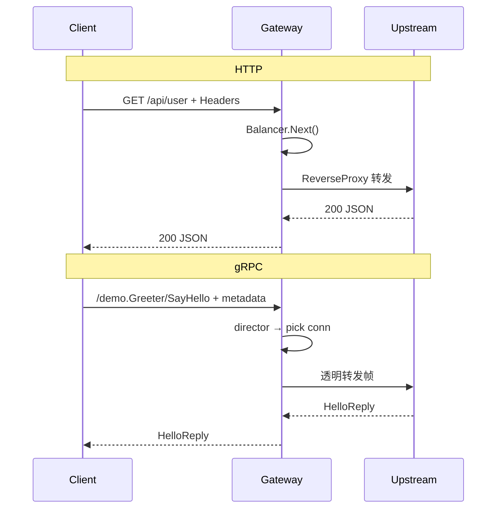

# ④ gRPC 透明代理网关（3~5 天）

> 所属：[gRPC 目录](./README.md) · 前置：[③ gRPC Client](./03-grpc-client.md)  
> 本模块产出：`cmd/grpc-gateway/main.go` + `internal/grpcproxy/`  
> README 要求：**基于 grpc-proxy 实现透明转发**

---

## 模块目标

实现 gRPC 网关：客户端连接 `:50051`，网关不解业务 proto，按 **full method name** 将请求转发到后端 `:50052` / `:50053`。

```
grpc-client → :50051 (UnknownServiceHandler)
                → director(ctx, fullMethodName)
                → 选 *grpc.ClientConn
                → 后端 Greeter/SayHello
                → 响应返回 client
```

**结束时应达到**：

- `go run ./cmd/grpc-client --gateway localhost:50051` 成功
- 多次调用可观察到不同 `instance`（简单轮询或随机）
- 能画出与 HTTP ReverseProxy 的架构对照图

---

## 进度对照

| 天 | 任务 | 状态 |
|----|------|------|
| 第 1 天 | 理解 grpc-proxy 与 director | ⬜ |
| 第 2 天 | 单后端透明转发 | ⬜ |
| 第 3 天 | 多后端 + ClientConn 池 | ⬜ |
| 第 4 天 | 复用 `lb.Balancer` | ⬜ |
| 第 5 天 | 错误处理、优雅关闭 | ⬜ |

---

## 第 1 天：架构与 grpc-proxy

### 任务

1. 阅读 [mwitkow/grpc-proxy](https://github.com/mwitkow/grpc-proxy) README
2. 理解 `UnknownServiceHandler` + `TransparentHandler`
3. 对比 HTTP 反向代理数据流

### 概念

| 组件 | 作用 |
|------|------|
| **前端 `grpc.Server`** | 对 Client 暴露统一入口 |
| **director** | 每个 RPC 决定连哪个后端 `*grpc.ClientConn` |
| **TransparentHandler** | 按 method 名转发，无需注册具体 Service |
| **ClientConn 池** | 每个后端地址维护长连接，避免每次 Dial |

### HTTP vs gRPC 代理架构



### director 函数签名

```go
type Director func(ctx context.Context, fullMethodName string) (context.Context, *grpc.ClientConn, error)
```

| 返回值 | 说明 |
|--------|------|
| `context.Context` | 可注入 metadata 传给后端 |
| `*grpc.ClientConn` | 必须是已 Dial 的连接 |
| `error` | 返回则 RPC 失败（如 503 无可用后端） |

### 检验标准

- [ ] 能说出「透明」= 网关不 import 业务 RPC 实现，只转发
- [ ] 知道 fullMethodName 示例：`/demo.Greeter/SayHello`

---

## 第 2 天：单后端转发

### 任务

1. 新建 `internal/grpcproxy/pool.go` 管理连接
2. 新建 `cmd/grpc-gateway/main.go`，固定转发到 `localhost:50052`

### 参考代码 — `internal/grpcproxy/pool.go`

```go
package grpcproxy

import (
	"sync"

	"google.golang.org/grpc"
	"google.golang.org/grpc/credentials/insecure"
)

// Pool 按 target 地址缓存 *grpc.ClientConn
type Pool struct {
	mu    sync.Mutex
	conns map[string]*grpc.ClientConn
}

func NewPool() *Pool {
	return &Pool{conns: make(map[string]*grpc.ClientConn)}
}

func (p *Pool) Get(target string) (*grpc.ClientConn, error) {
	p.mu.Lock()
	defer p.mu.Unlock()
	if c, ok := p.conns[target]; ok {
		return c, nil
	}
	c, err := grpc.Dial(target, grpc.WithTransportCredentials(insecure.NewCredentials()))
	if err != nil {
		return nil, err
	}
	p.conns[target] = c
	return c, nil
}

func (p *Pool) Close() {
	p.mu.Lock()
	defer p.mu.Unlock()
	for _, c := range p.conns {
		_ = c.Close()
	}
	p.conns = make(map[string]*grpc.ClientConn)
}
```

### 参考代码 — `cmd/grpc-gateway/main.go`（单后端版）

```go
package main

import (
	"context"
	"flag"
	"log"
	"net"

	"go-proxy-demo/internal/grpcproxy"

	"github.com/mwitkow/grpc-proxy/proxy"
	"google.golang.org/grpc"
)

func main() {
	listen := flag.String("listen", ":50051", "gateway listen address")
	backend := flag.String("backend", "localhost:50052", "single backend (day 2)")
	flag.Parse()

	pool := grpcproxy.NewPool()
	defer pool.Close()

	director := func(ctx context.Context, fullMethodName string) (context.Context, *grpc.ClientConn, error) {
		log.Printf("[director] %s -> %s", fullMethodName, *backend)
		conn, err := pool.Get(*backend)
		return ctx, conn, err
	}

	s := grpc.NewServer(
		grpc.UnknownServiceHandler(proxy.TransparentHandler(director)),
	)

	lis, err := net.Listen("tcp", *listen)
	if err != nil {
		log.Fatalf("listen: %v", err)
	}
	log.Printf("grpc gateway listening on %s -> backend %s", *listen, *backend)
	if err := s.Serve(lis); err != nil {
		log.Fatalf("serve: %v", err)
	}
}
```

### 验证

```powershell
# 终端 1：下游
go run ./cmd/grpc-downstream --port 50052

# 终端 2：网关
go run ./cmd/grpc-gateway

# 终端 3：经网关
go run ./cmd/grpc-client --gateway localhost:50051 --name proxy-test
```

### 检验标准

- [ ] 经 50051 调用成功，响应与直连 50052 一致
- [ ] 网关日志打印 fullMethodName

---

## 第 3 天：多后端与负载均衡

### 任务

1. director 内维护 backends 列表 `50052`、`50053`
2. 简单 **round-robin** 选 target（后续第 4 天换 `lb.Balancer`）
3. 某 backend 不可用时尝试下一个或返回 error

### 参考代码 — director 轮询

```go
var (
	backends = []string{"localhost:50052", "localhost:50053"}
	rr       uint64
)

director := func(ctx context.Context, fullMethodName string) (context.Context, *grpc.ClientConn, error) {
	i := atomic.AddUint64(&rr, 1)
	target := backends[i%uint64(len(backends))]
	conn, err := pool.Get(target)
	if err != nil {
		return ctx, nil, err
	}
	log.Printf("[director] %s -> %s", fullMethodName, target)
	return ctx, conn, nil
}
```

### 验证 LB

```powershell
1..6 | ForEach-Object {
  go run ./cmd/grpc-client --gateway localhost:50051 --name "req$_"
}
# 观察 instance 在 50052 / 50053 间轮换
```

### 检验标准

- [ ] 两个下游同时运行时，多次请求命中不同 instance
- [ ] 停掉一个下游时，行为符合预期（全失败或跳过，需在代码中明确策略）

---

## 第 4 天：接入现有 `lb.Balancer`

### 任务

1. 与 HTTP 网关相同，从 yaml 或硬编码读取 upstream 地址
2. gRPC 地址格式为 `host:port`（无 `http://` 前缀）
3. 调用 `balancer.Next()` 得到 target

### 地址转换

HTTP yaml 中为 `http://localhost:9001`，gRPC 需：

```go
func grpcAddr(httpURL string) string {
	u, _ := url.Parse(httpURL)
	if u.Host != "" {
		return u.Host // localhost:9001
	}
	return httpURL // 已是 host:port
}
```

建议 **gRPC 独立配置**（见 ⑤ `gateway.yaml` 的 `grpc.upstreams`），避免混用 HTTP 端口。

### director 使用 Balancer

```go
director := func(ctx context.Context, fullMethodName string) (context.Context, *grpc.ClientConn, error) {
	target, ok := balancer.Next()
	if !ok {
		return ctx, nil, status.Errorf(codes.Unavailable, "no upstream")
	}
	// target 应为 localhost:50052 形式
	conn, err := pool.Get(target)
	return ctx, conn, err
}
```

### 检验标准

- [ ] 与 HTTP 共用 `internal/lb/roundrobin.go` 等实现
- [ ] 配置变更后 `SetNodes` 生效

---

## 第 5 天：生产化细节

### 任务

1. 优雅关闭：`GracefulStop` + pool.Close
2. 连接失败返回 `codes.Unavailable`
3. （可选）Unary interceptor 记录 access log

### 优雅关闭示例

```go
import (
	"os"
	"os/signal"
	"syscall"
)

// main 末尾
go func() {
	sig := make(chan os.Signal, 1)
	signal.Notify(sig, syscall.SIGINT, syscall.SIGTERM)
	<-sig
	log.Println("shutting down grpc gateway...")
	s.GracefulStop()
}()

if err := s.Serve(lis); err != nil {
	log.Fatal(err)
}
```

### UnknownServiceHandler 说明

注册 `UnknownServiceHandler` 后，**所有** method 走 director；无需在网关 RegisterGreeterServer。这是「透明」的关键。

### TLS（阶段 4 可选）

学习阶段 `insecure` 即可。生产需：

- Client → Gateway：`credentials.NewTLS`
- Gateway → Backend：可 mTLS 或内网 plain

### 检验标准

- [ ] Ctrl+C 后进程正常退出
- [ ] 无 backend 时 Client 收到明确错误
- [ ] 能对比 HTTP `proxy.Handler` 与 gRPC director 职责相同

---

## 模块结束标准

- [ ] `cmd/grpc-gateway` 监听 `:50051`
- [ ] 使用 `grpc-proxy` TransparentHandler
- [ ] Client 经网关 SayHello 成功
- [ ] 多后端下可观察 LB 效果

**下一步** → [05-integration.md](./05-integration.md)：JWT metadata、Registry、配置、限流。
