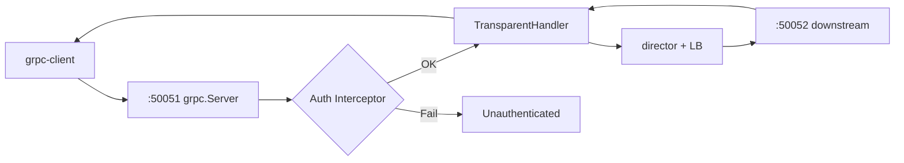

# ⑥ 自测清单、排错与 ReadME 对照

> 所属：[gRPC 目录](./README.md) · 前置：①~⑤ 或至少完成 ①~④  
> 用途：答辩演练、毕业设计验收、日常排错

---

## 毕业自测清单

在 `gateway/` 目录执行。标记 `[x]` 表示通过。

### 环境与子模块

- [ ] `protoc --version` 正常
- [ ] `go build ./...` 无错误
- [ ] `internal/pb/` 由 `greeter.proto` 生成

### 下游

- [ ] `go run ./cmd/grpc-downstream --port 50052` 启动
- [ ] `go run ./cmd/grpc-downstream --port 50053` 启动
- [ ] 直连 Client / grpcurl 分别得到 `instance=50052/50053`

### 网关

- [ ] `go run ./cmd/grpc-gateway` 监听 `:50051`
- [ ] `go run ./cmd/grpc-client --gateway localhost:50051` 成功
- [ ] 连续 6 次请求可观察到 LB 轮换（若两下游同权重）

### 鉴权（⑤ 完成后）

- [ ] HTTP 登录拿到 JWT
- [ ] 无 Token 调用网关 → 失败
- [ ] 带 `Bearer` Token → 成功

### 与 HTTP 共存

- [ ] 同时运行 HTTP 网关 `:8080` 与 gRPC 网关 `:50051` 无冲突
- [ ] 能口述两种协议在网关层的差异

---

## 一键启动脚本（参考）

`gateway/scripts/run-grpc-demo.ps1`：

```powershell
$Root = "d:\A_Software\Java\SAVE\Gateway\gateway"
Set-Location $Root

Write-Host "请开 4 个终端分别执行："
Write-Host "1. go run ./cmd/grpc-downstream --port 50052"
Write-Host "2. go run ./cmd/grpc-downstream --port 50053"
Write-Host "3. go run ./cmd/grpc-gateway"
Write-Host "4. go run ./cmd/grpc-client --gateway localhost:50051 --name demo"
```

---

## 完整验证命令

### 1. 生成 proto

```powershell
cd d:\A_Software\Java\SAVE\Gateway\gateway
protoc --proto_path=api/proto `
  --go_out=internal/pb --go_opt=paths=source_relative `
  --go-grpc_out=internal/pb --go-grpc_opt=paths=source_relative `
  api/proto/greeter.proto
```

### 2. 启动服务（4 终端）

```powershell
# T1
go run ./cmd/grpc-downstream --port 50052

# T2
go run ./cmd/grpc-downstream --port 50053

# T3
go run ./cmd/grpc-gateway -listen :50051

# T4 — HTTP 网关（鉴权测试时需要）
go run ./cmd/gateway
```

### 3. 直连下游

```powershell
go run ./cmd/grpc-client --target localhost:50052 --name direct-52
go run ./cmd/grpc-client --target localhost:50053 --name direct-53
```

### 4. 经网关

```powershell
1..6 | ForEach-Object {
  go run ./cmd/grpc-client --gateway localhost:50051 --name "gw-$_"
}
```

### 5. JWT 鉴权（⑤）

```powershell
# 取 token（按实际响应字段调整）
$json = curl.exe -s -X POST http://localhost:8080/gateway/login `
  -H "Content-Type: application/json" `
  -d '{"tenant":"tenant-a"}' | ConvertFrom-Json
$token = $json.token

go run ./cmd/grpc-client --gateway localhost:50051 --name secure --token $token
go run ./cmd/grpc-client --gateway localhost:50051 --name fail
# 第二条应失败
```

### 6. grpcurl

```powershell
grpcurl -plaintext localhost:50051 list
grpcurl -plaintext -d '{"name":"grpcurl"}' localhost:50051 demo.Greeter/SayHello
```

---

## 请求链路（答辩必讲）

### 经网关的 Unary RPC

1. Client `Dial("localhost:50051")`，发起 `/demo.Greeter/SayHello`
2. metadata 可选带 `authorization: Bearer <JWT>`
3. gRPC Server **UnaryInterceptor** 校验 JWT → 提取 tenant
4. **TransparentHandler** 调用 director
5. director `balancer.Next()` → `localhost:50052`
6. pool 返回已有 `ClientConn`，请求帧转发到下游
7. 下游 `Greeter.SayHello` 返回 `HelloReply`
8. 响应沿原路回到 Client



### 与 HTTP 链路并列讲解

| 步骤 | HTTP | gRPC |
|------|------|------|
| 入口 | Gin :8080 | grpc :50051 |
| 鉴权 | JWTAuth 中间件 | UnaryInterceptor |
| 限流 | RateLimit 中间件 | RateLimit Interceptor |
| 选节点 | pickTarget + Next() | director + Next() |
| 转发 | ReverseProxy | grpc-proxy |
| 审计 | RequestLogger | Logging Interceptor |

---

## ReadME 功能对照表

| ReadME 条目 | 实现位置 | 本目录章节 | 最低/完整 |
|-------------|----------|------------|-----------|
| gRPC grpc-proxy 透明转发 | `cmd/grpc-gateway` + `internal/grpcproxy` | ④ | **最低** |
| 四种负载均衡 | 复用 `internal/lb` | ④⑤ | 最低 |
| Bearer JWT + 租户 | metadata + `auth.Parse` | ⑤ | 完整 |
| Redis QPS/QPD | gRPC interceptor | ⑤ 可选 | 完整 |
| 动态服务注册 | `registry` + API | ⑤ 可选 | 完整 |
| 流量统计 | Redis 计数 | ⑤ 可选 | 完整 |
| 中间件链 | interceptor 链 | ④⑤ | 完整 |

**最低交付（时间紧）**：①~④ + 自测 3~4 节。  
**ReadME 对齐（答辩）**：①~⑥ 全部 + JWT + LB + 一项 Redis 能力。

---

## 常见问题与排错

### 连接与端口

| 现象 | 可能原因 | 处理 |
|------|----------|------|
| `connection refused` | 下游或网关未启动 | 检查 50051/50052 进程 |
| `port already in use` | 端口占用 | `netstat -ano \| findstr 50051` |
| 直连 OK，经网关失败 | director 地址错误 | 打印 director 选的 target |

### proto / 代码生成

| 现象 | 可能原因 | 处理 |
|------|----------|------|
| `unknown service demo.Greeter` | 下游未 Register | 检查 RegisterGreeterServer |
| method 名不对 | package 不一致 | full name 须 `/demo.Greeter/SayHello` |
| 生成代码 import 失败 | go_package 错误 | 对齐 `go-proxy-demo/internal/pb` |

### grpc-proxy

| 现象 | 可能原因 | 处理 |
|------|----------|------|
| `Unavailable` | director 返回 error | 检查 pool.Get / balancer |
| 只转发 Unary，stream 失败 | 未用 StreamHandler | 透明代理需 stream director（进阶） |
| 后端收到乱码 | 连错端口（HTTP 端口） | gRPC 必须连 gRPC 下游端口 |

### 鉴权

| 现象 | 可能原因 | 处理 |
|------|----------|------|
| `missing token` | 未传 metadata | Client 加 `authorization` |
| `invalid token` | secret 不一致 | gRPC 与 HTTP 共用 yaml jwt.secret |
| metadata 大小写 | key 被规范化 | 使用小写 `authorization` |

### 性能（阶段 4）

| 指标 | 说明 |
|------|------|
| 直连 QPS | 用 `ghz` 压 `SayHello` |
| 经网关 QPS | 对比延迟增量 |
| 连接数 | ClientConn 池大小 = 后端实例数 |

---

## 三种协议对比（README 三协议）

| | HTTP | TCP | gRPC |
|---|------|-----|------|
| 实现 | ReverseProxy | net + io.Copy | grpc-proxy |
| 端口示例 | 8080→900x | 8081→900x | 50051→5005x |
| 解析应用层 | 是 | 否 | 仅 method/metadata |
| 鉴权 | Header JWT | 难 | metadata JWT |
| LB 粒度 | 每请求 | 每连接 | 每 RPC |
| 本仓库文档 | [HTTP/](../HTTP/README.md) | [HTTP/07-tcp-grpc](../HTTP/07-tcp-grpc.md) | 本目录 |

---

## 阶段 4 延伸（工程化）

完成本目录后，可在 [learning-roadmap](../HTTP/learning-roadmap.md) 阶段 4 继续：

| 项 | 内容 |
|----|------|
| Docker | Dockerfile 多 stage，暴露 8080 + 50051 |
| TLS | cert-manager 或自签证书 |
| 压测 | `ghz --insecure -c 50 -n 10000 localhost:50051 ...` |
| 可观测 | OpenTelemetry grpc instrumentation |
| Admin UI | Vue 展示 gRPC 节点与 QPS |

---

## 文档索引

| 文件 | 内容 |
|------|------|
| [README.md](./README.md) | 总览与路线 |
| [01-environment-and-proto.md](./01-environment-and-proto.md) | protoc 与 proto |
| [02-grpc-downstream.md](./02-grpc-downstream.md) | 下游 Server |
| [03-grpc-client.md](./03-grpc-client.md) | 测试 Client |
| [04-grpc-proxy-gateway.md](./04-grpc-proxy-gateway.md) | **grpc-proxy 核心** |
| [05-integration.md](./05-integration.md) | JWT / LB / Registry |
| [06-testing-and-faq.md](./06-testing-and-faq.md) | 本文 |

---

**恭喜**：若以上清单全部打勾，你已具备 ReadME 所述 gRPC 透明代理能力，可与 HTTP 网关一并演示「三协议网关」。
