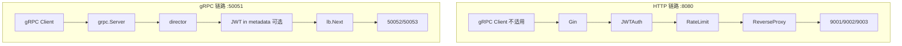

# gRPC 网关模块 — 详细教程目录

> 上级概览：[ReadME.md](../../ReadME.md) · HTTP 网关教程：[../HTTP/README.md](../HTTP/README.md)  
> 前置要求：完成 HTTP 阶段 3 模块 ①~⑥（鉴权 + 限流 + LB + 服务注册 + 中间件链）  
> 起点代码：[`gateway/`](../../gateway/)（模块名 `go-proxy-demo`）  
> README 目标：「HTTP/TCP/gRPC 三协议反向代理」中的 **gRPC 透明转发**（基于 `grpc-proxy`）

本目录把 [HTTP/07-tcp-grpc.md](../HTTP/07-tcp-grpc.md) 里较简略的 gRPC 部分**展开为可逐日执行的完整教程**。TCP 仍留在 HTTP 目录；gRPC 单独成体系，便于专注学习。

---

## 模块目标

在现有 HTTP 网关（`:8080`）之外，新增 **gRPC 透明代理网关**（`:50051`），使客户端经网关调用下游 gRPC 服务，并可选复用负载均衡、JWT 鉴权、服务注册等能力：

```
gRPC Client
  → Gateway :50051（grpc.Server + grpc-proxy）
  → director 选后端（复用 lb.Balancer / registry）
  → Backend :50052 / :50053（*grpc.ClientConn）
  → 响应原路返回
```

**结束时应达到**：

- 能写 `.proto`、生成 Go 代码、跑通下游 Server 与直连 Client
- 网关用 `grpc-proxy` 透明转发至少一个 unary RPC
- 能说清 gRPC 与 HTTP 网关在架构、鉴权、中间件上的差异
- （进阶）metadata 传 JWT，director 内校验租户

---

## 与 HTTP 网关的关系

| 维度 | HTTP 网关（已有） | gRPC 网关（本模块） |
|------|-------------------|---------------------|
| 框架 | Gin | `google.golang.org/grpc` |
| 代理 | `httputil.ReverseProxy` | `mwitkow/grpc-proxy` TransparentHandler |
| 端口 | `:8080` | `:50051`（建议独立） |
| 鉴权载体 | `Authorization` Header | gRPC metadata `authorization` |
| 路径路由 | URL Path（如 `/api/user`） | full method name（如 `/demo.Greeter/SayHello`） |
| 中间件 | Gin HandlerFunc 链 | interceptor + director 内逻辑 |
| LB 复用 | `lb.Balancer.Next()` | 同一接口，地址改为 `host:port` |



---

## 文档与进度

| 序号 | 文档 | 内容 | 预计 | 状态 |
|------|------|------|------|------|
| ① | [01-environment-and-proto.md](./01-environment-and-proto.md) | protoc 环境、`.proto` 编写、代码生成 | 2~3 天 | ⬜ |
| ② | [02-grpc-downstream.md](./02-grpc-downstream.md) | 多实例 gRPC 下游 Server | 2~3 天 | ⬜ |
| ③ | [03-grpc-client.md](./03-grpc-client.md) | 直连 Client、unary/streaming 概念 | 1~2 天 | ⬜ |
| ④ | [04-grpc-proxy-gateway.md](./04-grpc-proxy-gateway.md) | grpc-proxy 透明网关核心实现 | 3~5 天 | ⬜ |
| ⑤ | [05-integration.md](./05-integration.md) | LB、Registry、JWT metadata、限流 | 3~5 天 | ⬜ |
| ⑥ | [06-testing-and-faq.md](./06-testing-and-faq.md) | 毕业自测、排错、与 README 对照 | 1 天 | ⬜ |

**推荐顺序**：① → ② → ③（直连跑通）→ ④（经网关）→ ⑤（进阶）→ ⑥（验收）。

完成 ①~④ 即满足 README「gRPC 基于 grpc-proxy 透明转发」的**最低交付**；⑤ 对齐 README 的鉴权与 LB；⑥ 用于答辩 / 自测。

---

## 推荐目录结构（完成后）

在 `gateway/` 上扩展，**不破坏现有 HTTP 代码**：

```
gateway/
├── api/
│   └── proto/
│       └── greeter.proto          # 服务定义
├── cmd/
│   ├── gateway/main.go            # 现有 HTTP 网关
│   ├── downstream/main.go         # 现有 HTTP 下游
│   ├── grpc-downstream/main.go    # gRPC 下游（--port 50052/50053）
│   ├── grpc-client/main.go        # 测试 Client（--target / --gateway）
│   └── grpc-gateway/main.go       # gRPC 透明代理网关
├── internal/
│   ├── pb/                        # protoc 生成（勿手改）
│   ├── grpcproxy/                 # director、conn 池、鉴权（可选）
│   ├── lb/                        # 已有，复用
│   ├── registry/                  # 已有，复用
│   └── auth/                      # 已有，JWT 解析复用
└── internal/config/
    └── gateway.yaml               # 可增加 grpc 段（见 ⑤）
```

原则与 HTTP 阶段一致：**`main.go` 只组装，业务在 `internal/` 包内**。

---

## 端口规划

| 角色 | 端口 | 协议 | 说明 |
|------|------|------|------|
| HTTP 网关 | 8080 | HTTP/1.1 | 现有 Gin |
| HTTP 下游 ×3 | 9001~9003 | HTTP | 现有 |
| **gRPC 网关** | **50051** | HTTP/2 | 新建 |
| **gRPC 下游 ×2** | **50052~50053** | HTTP/2 | 新建 |

学习阶段 **HTTP 与 gRPC 分端口** 最简单；生产可通过 ALPN / 独立 Listener / Sidecar 合并入口。

---

## 环境准备

| 依赖 | 用途 | 文档 |
|------|------|------|
| Go 1.21+ | 编译运行 | 全程 |
| `protoc` | 编译 `.proto` | [①](./01-environment-and-proto.md) |
| `protoc-gen-go` / `protoc-gen-go-grpc` | 生成 Go 桩代码 | [①](./01-environment-and-proto.md) |
| 2~3 个终端 | 多下游 + 网关 + Client | ② 起 |
| HTTP 网关已跑通 | 证明 ③ 阶段完成 | [HTTP/06](../HTTP/06-middleware-chain.md) |

可选工具：

- [grpcurl](https://github.com/fullstorydev/grpcurl) — 命令行调 gRPC，无需写 Client
- [BloomRPC / Kreya](https://github.com/bloomrpc/bloomrpc) — GUI 调试

---

## 每日学习节奏（通用）

```
1. 读当天「任务」和「概念」（15 分钟）
2. 写 / 改代码（40~60 分钟）
3. 跑验证命令，对照「检验标准」打勾（15 分钟）
4. 画一张当天数据流（Client → Gateway → Backend）（5 分钟）
```

---

## 与 ReadME 功能对照

| ReadME 描述 | 本目录对应 |
|-------------|------------|
| gRPC 基于 grpc-proxy 透明转发 | [④ grpc-proxy 网关](./04-grpc-proxy-gateway.md) |
| 四种负载均衡 | [⑤ 复用 `internal/lb`](./05-integration.md) |
| Bearer JWT + 租户 | [⑤ metadata 鉴权](./05-integration.md) |
| 动态服务注册 | [⑤ gRPC 节点注册](./05-integration.md) |
| QPS/QPD 限流 | [⑤ interceptor 或 director 内限流](./05-integration.md)（进阶） |
| 流量统计 | [⑤ 按 tenant + method 计数](./05-integration.md)（进阶） |

---

## 快速开始（30 分钟预览）

若只想先「看见」gRPC 经网关转发，按顺序执行（细节见各章）：

```powershell
cd d:\A_Software\Java\SAVE\Gateway\gateway

# 1. 安装工具与依赖（见 ①）
go install google.golang.org/protobuf/cmd/protoc-gen-go@latest
go install google.golang.org/grpc/cmd/protoc-gen-go-grpc@latest
go get google.golang.org/grpc google.golang.org/protobuf
go get github.com/mwitkow/grpc-proxy/proxy

# 2. 创建 proto 并生成（见 ①）
# api/proto/greeter.proto → protoc ...

# 3. 三个终端
go run ./cmd/grpc-downstream --port 50052
go run ./cmd/grpc-downstream --port 50053
go run ./cmd/grpc-gateway

# 4. 经网关调用（见 ③④）
go run ./cmd/grpc-client --gateway localhost:50051 --name world
```

---

## 推荐资源

| 资源 | 链接 | 用途 |
|------|------|------|
| gRPC 官方概念 | https://grpc.io/docs/what-is-grpc/core-concepts/ | RPC 类型、metadata |
| Go 快速开始 | https://grpc.io/docs/languages/go/quickstart/ | 第一个 server/client |
| grpc-proxy | https://github.com/mwitkow/grpc-proxy | 透明转发 |
| HTTP/2 简介 | https://http2.github.io/ | 理解 gRPC 传输层 |
| 本项目 HTTP JWT | [../HTTP/02-jwt-auth.md](../HTTP/02-jwt-auth.md) | metadata 鉴权对照 |

---

## 常见问题（速查）

完整版见 [06-testing-and-faq.md](./06-testing-and-faq.md)。

| 问题 | 简答 |
|------|------|
| 必须先做 TCP 吗？ | 不必，gRPC 与 TCP 模块独立 |
| 能和 Gin 共用一个进程吗？ | 可以，`main` 里 `go grpcGateway()` + `r.Run()`，初学建议分开 `cmd` |
| JWT 放哪？ | metadata key：`authorization`，值：`Bearer <token>` |
| 健康检查怎么做？ | gRPC 常用 `grpc.health.v1.Health/Check` 或 TCP dial 端口 |
| 没有实现代码能学吗？ | 可以，按文档从零写；代码块均可直接复制 |

---

**下一步** → 打开 [01-environment-and-proto.md](./01-environment-and-proto.md)，安装 protoc 并编写第一个 `.proto`。
